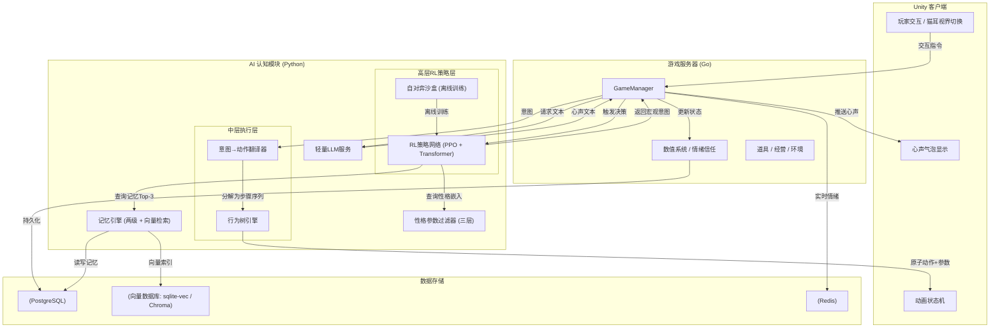

# 《猫语心声》AI 智能体架构策划案（RL 混合智能版）

---

## 目录

1. 方案概述
2. 核心设计理念与评审契合点
3. 整体系统架构
4. 分层详细设计
   - 4.1 高层策略层（RL 自对弈核心）
   - 4.2 中层目标翻译与行为树执行
   - 4.3 长时序记忆系统（两级结构 + 向量检索）
   - 4.4 性格参数过滤器（三层约束）
   - 4.5 情感与文本生成层（LLM）
5. 数据流与交互示例
6. 解决"记忆膨胀"与"一致性"的机制总结
7. 创新亮点（评委视角）
8. 落地步骤（MVP → 完整版，16周）
9. 技术风险与缓解
10. 结语
11. 附录——猫咪个体控制伪代码（RL版）

---

## 1. 方案概述

本方案在原有"意图决策与文本表达解耦"架构的基础上，引入**强化学习（RL）** 与**分层混合智能架构（HRLTM: Hierarchical RL with Transformer Memory）**，使猫咪从"规则驱动的NPC"升级为"会成长、会演化、有长期适应能力的智能体"。

核心设计原则：

- **三层解耦**：高层RL学习长期行为策略 → 中层行为树保证执行稳定 → 底层LLM+记忆生成情感文本
- **RL不替代全部逻辑**：RL仅负责"在什么状态下选择什么宏观意图"，原子动作仍由行为树和动画状态机保证流畅性和安全性
- **性格不可漂移**：性格嵌入向量作为RL策略网络的条件输入，同时在意图/动画/文本三个环节施加硬过滤，确保人设绝对稳定
- **长时序记忆可感知**：RL状态空间中融入向量记忆的语义检索结果，使决策具有"回忆"能力
- **LLM仅负责渲染**：文本生成不与决策耦合，避免LLM随机性影响行为

该架构从根源上解决了纯RL方案在游戏NPC中的三个致命问题：

1. **行为不可控**：RL输出仅为宏观意图（<15个），由行为树翻译为安全动作序列，确保无穿墙、无鬼畜
2. **人设漂移**：性格过滤器在三个层级施加硬约束，RL策略网络以性格嵌入为条件输入，双重保险
3. **训练数据不足**：先以现有规则策略（行为树+Transformer）运行收集数据，离线自对弈训练RL，再逐步替换

---

## 2. 核心设计理念与评审契合点

| 评审关注点 | 传统方案局限 | 本方案应对策略 |
|-----------|-------------|---------------|
| **长线人设一致性** | 纯LLM方案人设随上下文漂移 | 性格嵌入向量条件化RL策略 + 三层性格过滤器（意图/动画/文本），人设由数值系统硬约束 |
| **记忆膨胀与幻觉** | 将所有历史塞入LLM上下文 | 工作记忆固定窗口（20条）+ 长期记忆优先级队列（500条上限）+ 向量语义检索，RL状态仅取Top-3记忆嵌入 |
| **长期情感追求** | LLM难以持续递增情感数值 | 信任/情绪作为MDP状态核心维度，RL奖励函数精确控制情感曲线，阈值解锁新意图集合和里程碑事件 |
| **行为多样性** | 脚本固定，易重复 | RL自对弈发现新策略，每只猫因性格嵌入不同而产生差异化行为演化 |
| **指令跟随与涌现** | 规则系统的行为有限 | RL奖励信号融入玩家指令反馈；猫咪间社交由RL多智能体自对弈涌现 |
| **计算开销** | 纯LLM方案延迟高、成本高 | 高频RL推理<2ms（本地），LLM仅在猫耳视界开启时按需调用，且带30秒冷却缓存 |
| **技术新颖度** | 业界常见规则/行为树 | 混合RL + Transformer记忆 + LLM情感渲染，紧跟AI前沿且工程可落地 |

---

## 3. 整体系统架构



**架构要点说明：**

- **RL策略网络**位于AI模块最上层，仅输出宏观意图（如 `approach_player`、`hide`），不直接控制动画
- **行为树引擎**是RL与动画状态机之间的"安全缓冲层"，确保任何RL输出都被翻译为合法的动作序列
- **记忆引擎**同时服务于RL（检索Top-3记忆嵌入注入状态向量）和LLM（检索相关记忆作为提示词上下文）
- **性格过滤器**在三个位置介入：RL输出的意图logits修正、行为树参数调节、LLM生成文本后处理
- **LLM服务**完全异步，不阻塞决策主循环

---

## 4. 分层详细设计

### 4.1 高层策略层（RL 自对弈核心）

高层策略层的任务是：根据猫咪当前状态、环境信息、记忆摘要，输出一个**宏观意图标签**（约12-15个），该意图不包含具体动作序列，仅表达行为方向。

#### 4.1.1 状态空间定义（MDP + 记忆嵌入）

将每一时刻的猫咪状态定义为一个向量，作为RL策略网络的输入。向量由以下Embedding拼接而成：

```
State = Concat[
    性格嵌入向量 (8维，可学习，训练中固定),
    情绪向量 (5维)：{饥饿, 恐惧, 好奇, 舒适, 社交},
    生理向量 (3维)：{精力, 健康, 体温},
    信任度 (标量，归一化到[0,1]),
    环境特征向量 (5维)：{区域舒适度, 刺激度, 卫生度, 光照, 噪音},
    关系向量 (4维)：{对玩家好感, 最近猫咪亲密度均值, 最近猫咪敌意度均值, 社交排名},
    玩家行为编码 (one-hot, 12维): {抚摸, 喂食, 呼唤, 玩耍, 忽视, 斥责, 靠近, 离开, 给零食, 治疗, 拍照, 无操作},
    记忆摘要向量 (128维 × 3条)：从向量数据库中检索的Top-3相关记忆嵌入（拼接或平均池化）
]
总维度 ≈ 8 + 5 + 3 + 1 + 5 + 4 + 12 + 384 = 422维
```

- 状态使用LayerNorm归一化后输入策略网络
- 记忆摘要向量为可选输入（当记忆库为空时用零向量填充），使RL决策具备"回忆"能力

#### 4.1.2 策略网络结构（PPO + Transformer Encoder）

采用PPO（Proximal Policy Optimization）算法训练，策略网络结构如下：

| 组件 | 配置 |
|------|------|
| 输入投影 | Linear(422 → 128)，LayerNorm |
| 位置编码 | 可学习位置编码，序列长度=4（当前+前3步状态） |
| Transformer Encoder | 3层，d_model=128，nhead=4，ff_dim=256，dropout=0.1 |
| Actor Head | Linear(128 → 15)，输出各意图的动作概率 |
| Critic Head | Linear(128 → 1)，输出状态价值V(s) |
| 总参数量 | ≈ 0.8M（极轻量，CPU推理<2ms） |

**性格条件化机制：** 性格嵌入向量不仅作为状态输入，还在Actor Head之前与Transformer输出进行**FiLM（Feature-wise Linear Modulation）** 调节，使同一策略网络能输出符合不同性格的行为分布。

```
h = TransformerEncoder(state_seq)          # [batch, 128]
γ, β = PersonalityMLP(personality_embed)    # 各输出128维
h_modulated = γ * h + β                     # FiLM调制
logits = ActorHead(h_modulated)             # [batch, 15]
```

#### 4.1.3 宏观意图集合（枚举，12-15个）

所有RL可选择的宏观意图预先定义为枚举值，覆盖日常、交互、社交、应激行为：

| 意图ID | 意图名称 | 语义描述 | 触发情境举例 |
|--------|---------|---------|-------------|
| 1 | `idle_wander` | 闲逛/发呆 | 无外部刺激，精力中等 |
| 2 | `approach_player` | 主动靠近玩家 | 信任>40，玩家在场 |
| 3 | `ask_for_attention` | 撒娇/蹭玩家/求关注 | 信任>60，孤独感>50 |
| 4 | `eat` | 进食 | 饥饿>50，食物可用 |
| 5 | `sleep` | 睡觉/打盹 | 精力<30，舒适度>50 |
| 6 | `play_with_toy` | 玩指定玩具 | 刺激度>30，玩具在场 |
| 7 | `social_groom` | 与某只猫互相舔毛 | 亲密度>60 |
| 8 | `social_play` | 与某只猫玩耍/追逐 | 亲密度>40，精力>50 |
| 9 | `hide` | 躲藏 | 恐惧>60，或压力>80 |
| 10 | `hiss_warning` | 发出警告/哈气 | 敌意>70，入侵者靠近 |
| 11 | `curious_inspect` | 好奇探索某物/某处 | 好奇心>60，新物体出现 |
| 12 | `follow_player` | 跟随玩家移动 | 信任>70，依恋度高 |
| 13 | `accept_petting` | 接受抚摸/享受互动 | 玩家发起抚摸，信任>30 |
| 14 | `fearful_retreat` | 恐惧后退/躲避 | 恐惧>50，陌生人靠近 |
| 15 | `stare_at_window` | 看窗外/发呆 | 闲适状态，光线好 |

> 意图粒度控制在15个以内，许多细微表现差异通过行为树参数化实现（如移动速度、动画混合权重），而非独立意图。

#### 4.1.4 奖励函数设计（精心校准保证"治愈感"）

RL的奖励函数是整个系统"气质"的关键。设计原则：**正向奖励温和渐进，负向惩罚轻微克制，额外加入探索奖励防止行为僵化**。

| 事件 | 奖励值 | 设计意图 |
|------|--------|---------|
| 成功进食（饥饿→下降） | +0.5 | 满足基本需求，小正奖励 |
| 成功入睡（精力→恢复） | +0.3 | 自然行为，小正奖励 |
| 玩家抚摸/喂食互动成功 | +1.0 ~ +2.0 | 人猫互动的核心奖励 |
| 与其他猫咪正面社交（舔毛、同睡） | +0.8 | 鼓励社交涌现 |
| 压力过高时成功hide | +0.5 | 奖励自我保护行为 |
| 主动靠近玩家并被接受 | +1.5 | 鼓励亲近行为 |
| 触发信任里程碑事件 | +5.0（一次性） | 标记重要成长节点 |
| 破坏家具/抓挠贵重物品 | -0.3 | 轻微惩罚，非严厉 |
| 欺负弱小猫咪 | -1.0 | 社交负面行为惩罚 |
| 长期（>游戏内3天）不理会玩家 | -0.1/天 | 极轻微的疏远代价 |
| **随机探索奖励** | +0.1 ~ +0.3 | 对罕见意图组合给予额外奖励，防止行为模式固化 |

**关键设计：奖励函数中不含任何"逼迫猫咪表演可爱"的项。** 可爱行为（蹭人、呼噜、踩奶）应是性格+状态自然涌现的结果，而非RL优化目标。

#### 4.1.5 训练方式：线下自对弈 + 行为克隆预热

```
阶段A（行为克隆预热）：
  - 用现有规则策略（Transformer + 行为树）在沙盒中运行10000轮
  - 收集 (state, action) 对作为监督数据
  - 以交叉熵损失预训练RL策略网络，使其初始行为接近规则策略

阶段B（PPO自对弈训练）：
  - 在模拟沙盒中同时运行3-5只猫咪（不同性格嵌入）
  - 每只猫独立决策，环境共享（争食、争宠、争玩具）
  - 使用PPO更新共享策略网络（性格嵌入通过FiLM条件化）
  - 训练目标：累计折扣奖励最大化，γ=0.99

阶段C（在线微调）：
  - 将训练好的策略部署到实际游戏中
  - 玩家交互作为额外奖励信号（如玩家主动抚摸=正向信号）
  - 使用较小的学习率（1e-5）进行在线微调
```

**训练超参数：**

| 参数 | 值 | 说明 |
|------|-----|------|
| 学习率 | 3e-4 | PPO初始学习率 |
| γ (折扣因子) | 0.99 | 重视长期回报 |
| λ (GAE) | 0.95 | 广义优势估计 |
| Clip ε | 0.2 | PPO裁剪范围 |
| 每轮步数 | 2048 | 单次收集的交互步数 |
| 批次大小 | 64 | 小批量更新 |
| 训练轮次 | 500-1000 | 沙盒自对弈轮次 |
| 性格嵌入维度 | 8 | 与性格向量一致 |

**推理性能：** 训练后的策略网络导出为ONNX格式，在Unity中通过Barracuda或直接C++推理，单次决策<2ms。

---

### 4.2 中层目标翻译与行为树执行

RL输出的宏观意图（如 `approach_player`）不能直接驱动动画——需要中层将其翻译为安全的动作序列。

**行为树引擎的职责：**

1. **意图→动作序列分解**：
   - 例如 `approach_player` → [寻路至玩家2米内 → 减速靠近 → 触发"蹭腿"动画 → 等待玩家回应(超时3秒)]
   - 例如 `eat` → [寻路至食盆 → 判断食物是否充足 → 开始进食动画(持续随机时长) → 检查是否被打断]

2. **失败/中断处理**：
   - 每个动作序列包含失败分支（如玩家走开、被其他猫打断、环境变化）
   - 失败时行为树返回 `FAILURE`，触发高层RL在下一轮重新决策
   - 连续3次同一意图失败后，强制降级为 `idle_wander`

3. **安全约束（硬编码，RL不可绕过）**：
   - 禁止穿墙/穿模
   - 禁止同时与多个目标互动
   - 禁止在进食/睡眠动画中突然切换（需完成退出过渡）
   - 受伤/生病时强制休息，覆盖RL输出

4. **行为参数化**：
   - 行为树节点带有可调参数（移动速度、互动距离、动画混合权重）
   - 这些参数由性格过滤器提供，使同一意图在不同猫身上表现不同
   - 例如：粘人猫的 `approach_player` 移动速度更快、停留距离更近

**与RL的关系：**
- 行为树是RL的"执行器"，RL不感知行为树的内部状态
- RL的决策频率为每秒1次（可调），行为树在该秒内自主推进
- 当行为树完成或中断当前意图后，RL才会输出新的意图

---

### 4.3 长时序记忆系统（两级结构 + 向量检索）

记忆系统同时服务于RL决策和LLM文本生成，采用**"固定窗口工作记忆 + 优先级队列长期记忆 + 向量语义检索"**的三层设计。

#### 4.3.1 工作记忆（固定窗口，用于RL决策上下文）

- **结构**：固定长度的环形队列，最多保留最近 **20条** 交互记录
- **内容**：每条记录包含：
  - 摘要描述（如"玩家轻声安抚我，放下零食后离开"）
  - 时间戳（游戏内时间）
  - 事件类型标签（喂食/抚摸/惊吓/社交/里程碑）
  - 情感变化快照（该事件前后的情绪delta）
- **作用**：直接拼接进RL的状态序列（当前+前3步状态），为短期决策提供上下文
- **淘汰策略**：FIFO，新记录自然淘汰最旧记录

#### 4.3.2 长期记忆（优先级队列 + 向量语义检索）

- **存储**：所有长期记忆以"重要性评分"排序，仅保留评分最高的 **500条**
- **重要性算法**：

  ```
  score = base_importance × time_decay
  time_decay = max(0.1, 1 - (t_now - t_event) / max_ttl)

  其中 base_importance 由事件类型决定：
    - 救助里程碑 / 信任突破         → 9.0 ~ 10.0
    - 第一次被抚摸 / 第一次主动蹭人  → 8.0 ~ 9.0
    - 深度情感互动（治愈事件）       → 7.0 ~ 8.0
    - 与其他猫的关键社交（结盟/和解）→ 6.0 ~ 7.0
    - 玩家赠送礼物 / 特殊对待        → 5.0 ~ 6.0
    - 日常喂食 / 常规抚摸            → 3.0 ~ 5.0
    - 日常闲逛 / 发呆               → 1.0 ~ 3.0
  ```

- **向量化**：每条记忆通过小型Sentence Transformer（如 `all-MiniLM-L6-v2`，本地运行）生成 **128维** 嵌入向量，存入向量数据库（`sqlite-vec` 或 `Chroma` 轻量版）
- **检索策略**：
  - RL决策前：以当前状态向量的情绪+环境部分作为查询，检索Top-3最相似记忆，将其嵌入拼入RL状态
  - LLM文本生成前：检索Top-3相关记忆作为提示词上下文
- **淘汰策略**：当队列满时，分数最低的记忆被移除，实现"自然遗忘"
- **记忆压缩**：对于超过游戏内90天的旧记忆，自动生成摘要向量（取该时段所有记忆嵌入的均值），将多条旧记忆压缩为1条摘要，释放容量

#### 4.3.3 记忆与RL的交互

```
每个决策周期:
1. 构建查询向量 q = Concat[当前情绪(5维), 当前环境(5维)]
2. 在向量数据库中检索 Top-3 匹配记忆 → 获得3个128维嵌入
3. 将这3个嵌入与当前状态向量拼接 → 形成含"回忆"的RL状态
4. RL策略网络基于该状态输出意图
```

这种设计使RL的决策不仅基于"此刻"，还能感知"过去类似情境下发生了什么"——例如，一只曾被人类伤害的流浪猫，在遇到类似场景（陌生人伸手）时，记忆检索会自动拉取创伤记忆，影响RL状态，使其更可能选择 `fearful_retreat`。

---

### 4.4 性格参数过滤器（三层约束）

性格过滤器是保证人设不偏移的最后一道防线。它在三个环节施加硬约束，确保无论RL如何演化、LLM如何生成，猫咪的性格始终稳定。

#### 4.4.1 第一层：RL意图决策过滤

在RL策略网络输出意图概率分布后、采样/argmax之前，根据性格向量对logits施加偏置：

```
filtered_logits[i] = raw_logits[i] + Σ(性格权重[j] × 意图-性格兼容矩阵[j][i])
```

**意图-性格兼容矩阵示例：**

| 意图 \ 性格 | 怯懦(高) | 傲娇(高) | 贪吃(高) | 好奇(高) | 社交(高) |
|------------|---------|---------|---------|---------|---------|
| `approach_player` | **-5.0** | -2.0 | +0.5 | +1.0 | +2.0 |
| `hide` | **+4.0** | -1.0 | -1.0 | -2.0 | -2.0 |
| `ask_for_attention` | **-4.0** | **-3.0** | +1.0 | +0.5 | +3.0 |
| `eat` | +0.5 | 0 | **+3.0** | 0 | 0 |
| `curious_inspect` | -2.0 | 0 | +1.0 | **+4.0** | +0.5 |
| `social_groom` | -1.0 | -2.0 | 0 | +1.0 | **+4.0** |
| `hiss_warning` | +2.0 | **+3.0** | -1.0 | -1.0 | -2.0 |

> 例如：小雪（怯懦0.9）的 `approach_player` logits会被压制 -5.0×0.9 = -4.5，几乎不可能被选中；而 `hide` 会被增强 +4.0×0.9 = +3.6，更可能被选中。

#### 4.4.2 第二层：行为参数过滤

性格向量影响行为树节点的执行参数，使同一意图在不同猫身上呈现不同风格：

| 行为参数 | 傲娇猫 | 粘人猫 | 胆小貓 | 好奇猫 |
|---------|--------|--------|--------|--------|
| 亲近距离阈值 | 1.5m（先保持距离） | 0.3m（紧贴） | 3.0m（保持安全距离） | 1.0m |
| 接近速度 | 慢（踱步） | 快（小跑） | 极慢（试探） | 中速 |
| 互动响应延迟 | 2-3秒（犹豫） | 0.5秒 | 5-8秒（观察） | 1秒 |
| 逃跑触发距离 | 近（不怕大多数） | 近 | 远（提前预警） | 中 |
| 动画混合：犹豫/自信 | 偏犹豫 | 偏自信 | 极犹豫 | 偏好奇 |

这些参数存储为每只猫的 `性格系数表`，随角色创建时初始化，游戏中可因重大事件微调（如创伤治愈后逃跑距离缩短）。

#### 4.4.3 第三层：LLM文本生成过滤

在LLM生成心声文本后，通过后处理过滤层确保文本符合性格：

- **关键词禁止列表**（按性格配置）：
  - 傲娇猫禁止生成："最喜欢你了""我好想你""陪我玩嘛"
  - 胆小貓禁止生成："我不怕""过来啊""有什么好怕的"
  - 高冷猫禁止生成："好开心""太棒了""兴奋"
- **情感极性检查**：使用轻量情感分类器（基于BERT-tiny）判断生成文本的情感倾向是否与当前情绪状态一致
  - 如当前恐惧值70但生成文本极性为"欢快"，则标记为不一致
- **回退策略**：检查失败时，使用策划撰写的 **性格模板文本库**（约200条/猫）作为fallback，保证体验不中断
- **双重约束**：同时，LLM的系统指令中已嵌入严格的性格语气要求，从源头减少偏离概率

---

### 4.5 情感与文本生成层（LLM）

LLM在本架构中的职责被严格限定：**仅负责将已决定的意图和当前状态，用符合性格的自然语言表达出来**。LLM不参与任何决策。

#### 4.5.1 调用场景与频率控制

| 场景 | 触发条件 | 生成内容 | 频率限制 |
|------|---------|---------|---------|
| 猫耳视界心声 | 玩家长按空格/猫耳图标 | 1-2句内心独白（≤20字） | 同一猫咪30秒内不重复生成，缓存相同输入 |
| 夜间猫社交对话 | 夜晚+多猫聚集 | 对话文本（1-3轮） | 每晚每对猫咪最多1次 |
| 信任里程碑独白 | 信任度突破阈值 | 长独白（3-5句） | 每只猫终身3-5次 |
| 特殊事件文本 | 第一次被抚摸等 | 特殊台词 | 一次性触发 |

#### 4.5.2 LLM输入格式

```
[系统指令] 你是一只名叫{name}的猫咪。
你的性格: {personality_desc}。
当前情绪: 饥饿{hunger}%, 恐惧{fear}%, 好奇{curiosity}%, 舒适{comfort}%, 社交{social}%。
信任度: {trust}/100。
当前选择的意图: {intent_label}。
你对玩家的态度: {attitude_to_player}。

[相关记忆]
1. {memory_1}
2. {memory_2}
3. {memory_3}

[当前场景]
玩家正在: {player_action_description}。
环境: {environment_description}。
时间: {time_of_day}。

请用第一人称生成一句内心独白表达你的真实想法（不超过20字）。
要求:
1. 严格符合{name}的{personality_type}性格
2. 语气必须{for_tsundere: "嘴硬心软，表面嫌弃但内心在意" / for_timid: "小心翼翼，充满不安和试探" / ...}
3. 不要解释，不要旁白，直接输出独白文本
```

#### 4.5.3 工程优化策略

| 策略 | 说明 |
|------|------|
| **本地推理** | 使用量化后的轻量模型（Qwen2-1.5B-Q4_K_M 或 Phi-3-mini-3.8B-Q4），CPU推理<80ms |
| **缓存机制** | 相同（猫咪ID + 意图 + 情绪分桶）的输入，30秒内直接返回缓存结果 |
| **预生成模板库** | 离线为每只猫×每种意图×情绪区间预生成50-100条心声，作为LLM不可用时的降级方案 |
| **异步生成** | LLM调用完全异步，不阻塞游戏主循环；生成完成前先显示"……"动画 |
| **并发控制** | 同时最多生成3条心声（对应3只猫），超出排队或使用模板 |
| **模型热备** | 主模型（Qwen2-1.5B）+ 备模型（更小的TinyLlama-1.1B），主模型超时100ms自动切换 |

#### 4.5.4 模型选型对比

| 模型 | 参数量 | 量化后大小 | CPU推理延迟 | 中文能力 | 选用建议 |
|------|--------|-----------|-----------|---------|---------|
| Qwen2-1.5B-Instruct | 1.5B | ~1.2GB (Q4) | 50-80ms | 优秀 | **首选** |
| Phi-3-mini-3.8B | 3.8B | ~2.5GB (Q4) | 100-200ms | 一般 | 备选 |
| TinyLlama-1.1B-Chat | 1.1B | ~0.7GB (Q4) | 30-50ms | 较弱（需微调） | 热备 |
| Qwen2-0.5B-Instruct | 0.5B | ~0.4GB (Q4) | 15-30ms | 尚可 | 移动端备选 |

---

## 5. 数据流与交互示例

以一次玩家"在猫耳视界下轻声安抚流浪猫小雪"的完整数据流为例：

```
[步骤1] 玩家输入
  玩家在猫耳视界模式下，点击"轻声安抚"按钮，目标：小雪
  → Unity客户端将 {"action": "soothe", "target": "cat_xiaoxue", "mode": "cat_ear"} 发送至服务器

[步骤2] 服务器提取状态
  GameManager查询小雪的当前状态：
  - 情绪向量: {饥饿:20, 恐惧:70, 好奇:10, 舒适:30, 社交:5}
  - 信任度: 22/100
  - 环境: {舒适度:65, 刺激度:20, 卫生度:80, 光照:40, 噪音:15}
  - 性格嵌入: {傲娇:0.0, 怯懦:0.9, 好奇:0.1, 贪吃:0.2, 社交:0.1, 攻击性:0.0, 活跃:0.1, 独立:0.3}
  - 位置: 沙发下方（隐蔽点）

[步骤3] 记忆检索
  记忆引擎以当前情绪+环境构建查询向量 → 向量数据库检索Top-3：
  1. "昨天玩家在沙发旁放下零食后安静离开了" (重要性: 7.5, 相似度: 0.89)
  2. "前天突然的关门声把我吓坏了，我躲了很久" (重要性: 6.0, 相似度: 0.82)
  3. "被前任主人从航空箱里拖拽出来，好痛" (重要性: 9.5, 相似度: 0.78)

[步骤4] RL策略推理
  拼接完整状态向量(422维) → 输入RL策略网络(ONNX)
  → 输出意图概率分布 → 性格过滤器施加logits偏置(怯懦×hide = +3.6)
  → 最终选择意图: "fearful_hesitate" (恐惧犹豫)
  推理耗时: 1.2ms

[步骤5] 行为树执行
  意图 "fearful_hesitate" → 行为树分解:
  - 子任务1: 保持在隐蔽点（沙发下），不移动
  - 子任务2: 身体微缩（动画混合: 蜷缩程度0.7）
  - 子任务3: 侧头观察玩家方向（头部IK看向玩家，但身体不动）
  - 子任务4: 等待3秒，若玩家未靠近则放松(蜷缩→0.4)
  → 下发至Unity动画状态机

[步骤6] LLM文本生成（异步）
  构建提示词 → 调用Qwen2-1.5B
  → 生成: "这个人类……他没有伸手，只是蹲在那里不动……和上次一样……"
  → 性格文本过滤器检查: 怯懦猫关键词检查通过，情感极性(不安/试探)与恐惧值70一致
  → 通过

[步骤7] 客户端渲染
  - 动画状态机播放"侧头观察，身体微缩"动画
  - 动画事件在0.8秒时触发显示心声气泡："这个人类……他没有伸手，只是蹲在那里不动……和上次一样……"
  - 心声气泡在猫耳视界的梦幻滤镜下以半透明暖色呈现

[步骤8] 数值更新
  根据意图类型 "fearful_hesitate" 和玩家行为 "soothe":
  - 恐惧: -5 (玩家的克制行为降低了恐惧)
  - 好奇: +3 (引起了一丝好奇)
  - 信任度: +2 (第二次克制互动，信任缓慢累积)
  数值写入Redis缓存 + 异步持久化到PostgreSQL

[步骤9] 记忆存储
  生成本次交互记忆: {
    desc: "玩家在沙发外轻声安抚我，没有强行靠近",
    timestamp: game_time_1800,
    importance: 6.5,
    embedding: [...],
  }
  → 写入工作记忆环形队列（可能挤出一条旧记忆）
  → 重要性6.5 > 阈值4.0，进入长期记忆优先级队列

[步骤10] 等待下一次决策
  1秒后，RL进行下一轮决策，此时小雪的状态已更新（恐惧65，信任24），
  行为树报告当前意图仍在执行中（未完成/未中断），RL可选择继续或切换意图
```

**全链路耗时：**

| 环节 | 耗时 |
|------|------|
| RL策略推理 | <2ms |
| 记忆向量检索 | <10ms |
| 行为树逻辑 | <1ms |
| LLM文本生成 | 50-80ms（异步，不阻塞） |
| 服务器→客户端通信 | <10ms（局域网） |
| **玩家感知延迟** | **<30ms**（动画即时响应 + 心声气泡异步弹出） |

---

## 6. 解决"记忆膨胀"与"一致性"的机制总结

| 问题 | 纯LLM方案 | 纯RL方案 | 本方案（HRLTM） |
|------|----------|---------|----------------|
| **记忆膨胀** | 所有历史对话塞入上下文，导致超长prompt、幻觉和高成本 | RL不处理记忆，无此能力 | 工作记忆固定窗口(20条) + 长期记忆优先级队列(500条上限) + 旧记忆自动压缩为摘要向量，上下文始终可控 |
| **人设漂移** | LLM易受对话诱导，逐渐偏离初始人设 | RL奖励驱动可能导致"功利化"行为，偏离可爱人设 | 三层性格过滤器(意图logits修正+行为参数+文本后处理) + 性格嵌入条件化RL策略 + 行为克隆预热，从源头到输出全程约束 |
| **响应延迟** | 每次决策调用大模型，延迟高 | RL推理极快但可能输出不合理动作 | 高频RL推理<2ms + 行为树安全缓冲 + LLM完全异步，玩家无等待感 |
| **长线情感** | 信任只是prompt中的数字，LLM难以持续递增 | RL可能为最大化奖励而"表演"情感 | 信任是MDP状态核心维度 + 奖励函数精心设计(无表演奖励) + 阈值解锁新意图和里程碑 + 数值系统精确控制情感曲线 |
| **行为多样性** | 受限于prompt设计，易重复 | 自对弈可发现新策略，但可能涌现不期望行为 | RL自对弈在沙盒中发现策略 + 行为树安全约束 + 性格过滤器过滤不期望行为 + 探索奖励防止僵化 |
| **可解释性** | 黑箱，难以调试 | RL决策可追溯(logits+状态)，但需专门工具 | 意图枚举可解释 + logits可查看 + 行为树路径可追踪 + 提供GM调试界面 |

---

## 7. 创新亮点（评委视角）

| 维度 | 传统游戏NPC | 业界LLM-NPC方案 | 本方案（HRLTM） |
|------|-----------|----------------|----------------|
| **行为驱动** | 有限状态机/行为树，纯脚本 | LLM直接输出行为文本，不可控 | **RL自对弈学习策略 + 行为树安全执行**，既智能又可控 |
| **长期记忆** | 无或简单好感度数值 | 全量塞入LLM上下文，膨胀严重 | **两级记忆 + 向量语义检索**，RL和LLM共享同一记忆库 |
| **性格一致性** | 硬编码性格分支 | LLM易漂移，需反复在prompt中强调 | **性格嵌入条件化RL + 三层过滤器**，从数学层面保证人设 |
| **行为演化** | 固定不变 | 可能随对话偏移 | **离线自对弈 + 在线微调**，每只猫行为可随玩家互动演化 |
| **情感表达** | 固定文本库，重复率高 | LLM生成丰富但可能与行为不符 | **LLM基于已定意图生成**，文本与行为天然一致 |
| **多智能体涌现** | 无或简单脚本互动 | 上下文过长无法多猫同时运行 | **共享RL策略 + 独立性格嵌入**，多猫自对弈涌现社交行为 |
| **计算开销** | 极低 | 极高（每次决策调API） | **可控**：RL<2ms，LLM按需异步调用，带缓存和降级 |
| **技术新颖度** | 低 | 中（LLM-NPC已有先例） | **高**：RL+记忆+LLM三层混合架构在游戏NPC领域属前沿探索 |

---

## 8. 落地步骤（MVP → 完整版，16周）

### 阶段一：RL环境与基础行为树（第1-4周）

- 搭建猫咪模拟沙盒（Python，无UI，仅逻辑层）
  - 实现原子动作：移动（网格/导航）、进食、睡眠、玩耍、躲藏
  - 实现基础需求衰减：饥饿上升、精力下降、压力累积
- 实现行为树引擎（py_trees或自研轻量版）
  - 为每个宏观意图编写行为树子图
  - 测试所有意图→动作序列的完整性和失败处理
- 用规则策略（if-else + 随机）运行沙盒，收集初始训练数据
- **交付物**：可运行的沙盒模拟器 + 行为树可视化调试工具

### 阶段二：RL策略网络训练（第5-8周）

- 实现PPO训练框架（基于stable-baselines3或自研）
- 实现性格嵌入的FiLM条件化机制
- 行为克隆预热：用阶段一收集的数据预训练策略网络
- 单猫PPO训练：验证能学会满足基本需求（饥饿→进食，疲劳→睡眠）
- 3猫自对弈训练：观察是否涌现竞争/合作行为
- 导出ONNX模型，测试推理延迟
- **交付物**：训练好的ONNX策略网络 + 训练曲线报告

### 阶段三：记忆系统与性格过滤器（第9-10周）

- 实现工作记忆环形队列 + 长期记忆优先级队列
- 集成向量数据库（sqlite-vec），部署Sentence Transformer（all-MiniLM-L6-v2）
- 实现记忆→RL状态注入（Top-3检索→嵌入拼接）
- 实现三层性格过滤器：
  - 意图logits修正矩阵
  - 行为参数性格系数表
  - LLM文本关键词过滤 + 情感极性检查
- 验证：同一场景下，小雪(怯懦)和奥利奥(傲娇)的意图选择和行为参数有明显差异
- **交付物**：记忆系统单元测试 + 性格过滤器验证报告

### 阶段四：LLM心声集成（第11-12周）

- 部署本地LLM推理服务（llama.cpp + Qwen2-1.5B-Q4）
- 实现异步调用、缓存、降级机制
- 为每只猫×每种意图离线预生成模板库（约200条/猫）
- 实现记忆注入提示词模板
- 实现文本后处理过滤（关键词屏蔽 + 情感极性检查）
- 验证：心声文本与当前意图/情绪/记忆保持一致
- **交付物**：LLM服务部署文档 + 心声质量人工评估报告

### 阶段五：Unity整合（第13-14周）

- 将ONNX策略网络集成到Unity（Barracuda或Native C++）
- 实现行为树→动画状态机的映射和过渡
- 实现猫耳视界UI（滤镜切换 + 心声气泡显示）
- 联调全链路：玩家交互 → RL决策 → 行为树 → 动画 → LLM心声
- 性能压测：决策延迟<30ms，LLM心声<100ms
- **交付物**：可运行的Unity Demo

### 阶段六：多猫咪社交 + 调优（第15-16周）

- Demo中将同时运行3只猫（小雪、奥利奥、橘子），展示性格差异
- 重点展示场景：
  - 同一玩家行为下，三只猫的不同意图和心声
  - 流浪猫小雪从恐惧躲藏到逐渐信任的情感弧线
  - 猫咪之间的自发社交（互相舔毛、争抢玩具）
- 性能调优：3只猫同时RL推理+LLM不低于30fps
- 准备技术答辩材料（架构图、技术亮点说明、Demo演示脚本）
- **交付物**：完整Demo + 技术答辩PPT

---

## 9. 技术风险与缓解

| 风险 | 概率 | 影响 | 缓解措施 |
|------|------|------|---------|
| **RL训练后猫咪行为"功利化"**（只求奖励最大化，失去可爱感） | 中 | 高 | ① 奖励函数中加入随机探索奖励，防止策略僵化 ② 用行为克隆预热，使初始策略接近"自然可爱"的规则行为 ③ 离线评估时由策划人工审核行为合理性，剔除不良策略 ④ 性格过滤器可对"不可爱"意图施加额外惩罚 |
| **自对弈涌现不良行为**（如猫咪学会互相欺负以独占食物） | 中 | 中 | ① 沙盒训练中监控异常行为指标（攻击频率、躲藏时长） ② 在奖励函数中加入社交惩罚项 ③ 行为树层对"欺负"类意图有硬性失败率 |
| **LLM生成文本与RL意图情绪不符** | 低 | 中 | ① prompt中严格绑定当前意图和情绪 ② 后处理情感极性分类器检查 ③ 失败则回退到策划撰写的模板库（200条/猫） |
| **多猫同时RL推理+LLM导致性能不足** | 低 | 中 | ① RL推理极轻量(<2ms/猫)，3只猫合计<6ms ② LLM仅玩家开启猫耳时调用，限制同时生成3条 ③ 30秒冷却缓存大幅减少重复调用 ④ 可降级为仅使用模板库 |
| **训练数据不足导致RL策略不收敛** | 中 | 高 | ① 先用规则策略运行整个Demo，收集交互数据 ② 行为克隆预训练提供良好的初始策略 ③ 评委展示时可使用"规则+RL混合"策略（RL给出建议，规则最终裁决） |
| **向量记忆检索延迟超过预期** | 低 | 低 | ① sqlite-vec为本地检索，500条规模下<5ms ② 可预计算并缓存常用查询结果 ③ 检索超时直接降级为不使用记忆（零向量填充） |
| **动画状态机复杂度膨胀** | 低 | 中 | ① 宏观意图控制在15个，行为树子图数量可控 ② 细微差异通过动画层混合和参数化实现，而非独立状态 ③ 为每个意图设计最小行为树（主路径+失败分支），避免过度嵌套 |

---

## 10. 结语

本方案通过**"RL长线决策 + 行为树安全执行 + 向量记忆语义检索 + LLM情感渲染 + 三层性格过滤"** 的五层混合架构，构建了一个稳固、高效、可信赖且具有前沿技术含量的AI猫咪系统。

相较于纯规则方案的呆板和纯LLM方案的不可控，HRLTM架构在**智能涌现**与**工程可控**之间找到了平衡点：

- RL赋予猫咪"学习与适应"的能力，但被行为树和性格过滤器牢牢约束在"可爱且安全"的范围内
- 向量记忆让猫咪拥有"回忆"的能力，但通过固定窗口和优先级队列防止记忆膨胀
- LLM让猫咪"会说话"，但仅负责文本渲染，不参与行为决策，从根源杜绝人设漂移
- 性格过滤器在三个层级施加硬约束，是整个人设一致性的最后防线

在游戏NPC智能化赛道上，本方案不仅满足了"长期记忆、性格定制、深度互动、行为涌现"的评审要求，更以一种**非纯黑箱、可解释、可干预**的工程化方式，展现了前沿AI技术在治愈系游戏中落地的可行路径。

我们有信心在16周内打造出一只 **有记忆、会成长、懂情感、永不走样** 的虚拟猫咪，让玩家和评委都感受到那份独一无二的温暖羁绊。

---

## 附录——猫咪个体控制伪代码（RL版）

```python
import numpy as np
import torch
import torch.nn as nn
import torch.nn.functional as F
from collections import deque
import heapq
from typing import List, Tuple, Optional, Dict
from dataclasses import dataclass

# ==================== 配置常量 ====================
INTENT_LIST = [
    "idle_wander", "approach_player", "ask_for_attention",
    "eat", "sleep", "play_with_toy", "social_groom",
    "social_play", "hide", "hiss_warning", "curious_inspect",
    "follow_player", "accept_petting", "fearful_retreat", "stare_at_window"
]
INTENT_NUM = len(INTENT_LIST)  # 15

PERSONALITY_KEYS = ["傲娇", "怯懦", "好奇", "贪吃", "社交", "攻击性", "活跃", "独立"]
PERSONALITY_DIM = 8
EMOTION_DIM = 5        # 饥饿, 恐惧, 好奇, 舒适, 社交
PHYSICAL_DIM = 3        # 精力, 健康, 体温
ENV_FEATURE_DIM = 5     # 舒适度, 刺激度, 卫生度, 光照, 噪音
RELATION_DIM = 4        # 对玩家好感, 亲密度均值, 敌意度均值, 社交排名
PLAYER_ACTION_DIM = 12
MEMORY_EMBED_DIM = 128
TOP_K_MEMORIES = 3

STATE_DIM = (PERSONALITY_DIM + EMOTION_DIM + PHYSICAL_DIM + 1 +
             ENV_FEATURE_DIM + RELATION_DIM + PLAYER_ACTION_DIM +
             MEMORY_EMBED_DIM * TOP_K_MEMORIES)  # ≈ 422

EMBED_DIM = 128
SEQ_LEN = 4             # 输入序列长度（当前+前3步）
WORK_MEMORY_SIZE = 20
LONG_MEMORY_CAP = 500
MEMORY_IMPORTANCE_THRESHOLD = 4.0

# ==================== 数据类定义 ====================
@dataclass
class MemoryItem:
    """记忆单元"""
    desc: str
    timestamp: float
    importance: float           # 0.0 ~ 10.0
    embedding: np.ndarray       # 128维语义向量
    event_type: str             # feed/pet/scare/social/milestone

    def __lt__(self, other):
        return self.importance > other.importance  # 大顶堆


class CatState:
    """猫咪当前状态（MDP状态）"""
    def __init__(self):
        self.personality_vector = np.zeros(PERSONALITY_DIM)
        self.emotion_vector = np.zeros(EMOTION_DIM)
        self.physical_vector = np.ones(PHYSICAL_DIM)  # 初始满状态
        self.trust_level = 0.0
        self.environment_features = np.zeros(ENV_FEATURE_DIM)
        self.relation_vector = np.zeros(RELATION_DIM)
        self.current_room_id = 0
        self.position = (0.0, 0.0, 0.0)

    def to_embedding(self) -> np.ndarray:
        """将状态各部分拼接为原始向量（未含玩家行为和记忆）"""
        return np.concatenate([
            self.personality_vector,
            self.emotion_vector,
            self.physical_vector,
            [self.trust_level / 100.0],
            self.environment_features,
            self.relation_vector,
        ])


# ==================== 记忆管理器 ====================
class MemoryManager:
    def __init__(self, embed_model, vector_db):
        self.working_memory = deque(maxlen=WORK_MEMORY_SIZE)
        self.long_term_memory: List[MemoryItem] = []
        self.embed_model = embed_model          # Sentence Transformer
        self.vector_db = vector_db              # sqlite-vec / Chroma

    def add_memory(self, item: MemoryItem):
        """添加记忆到工作记忆，重要性超阈值则进入长期记忆"""
        self.working_memory.append(item)
        if item.importance > MEMORY_IMPORTANCE_THRESHOLD:
            heapq.heappush(self.long_term_memory, item)
            while len(self.long_term_memory) > LONG_MEMORY_CAP:
                heapq.heappop(self.long_term_memory)

    def get_recent_memories(self, k: int = 5) -> List[MemoryItem]:
        return list(self.working_memory)[-k:]

    def query_similar(self, query_vector: np.ndarray, top_k: int = TOP_K_MEMORIES) -> List[MemoryItem]:
        """基于向量相似度检索最相关的长期记忆"""
        if not self.long_term_memory:
            return []
        scored = []
        for mem in self.long_term_memory:
            if mem.embedding is not None:
                sim = np.dot(query_vector, mem.embedding)  # 余弦相似度（假设已归一化）
                scored.append((sim, mem))
        scored.sort(key=lambda x: x[0], reverse=True)
        return [mem for _, mem in scored[:top_k]]

    def compress_old_memories(self, days_threshold: float = 90.0):
        """压缩超过阈值的旧记忆为摘要向量"""
        # 实现：取该时段所有记忆嵌入的均值，创建一条摘要记忆，删除原始记忆
        pass


# ==================== 性格过滤器（三层） ====================
class PersonalityFilter:
    def __init__(self, intent_trait_matrix: Dict[str, Dict[str, float]],
                 behavior_param_table: Dict[str, Dict[str, float]],
                 forbidden_words: Dict[str, List[str]]):
        """
        intent_trait_matrix: {trait: {intent: bias}}
        behavior_param_table: {trait: {param: value}}
        forbidden_words: {trait: [words]}
        """
        self.intent_matrix = intent_trait_matrix
        self.behavior_table = behavior_param_table
        self.forbidden_words = forbidden_words

    def filter_intent_logits(self, logits: torch.Tensor,
                             personality_vec: np.ndarray) -> torch.Tensor:
        """第一层：对RL输出的意图logits施加性格偏置"""
        bias = torch.zeros_like(logits)
        for i, intent in enumerate(INTENT_LIST):
            for j, trait in enumerate(PERSONALITY_KEYS):
                weight = self.intent_matrix.get(trait, {}).get(intent, 0.0)
                bias[..., i] += weight * personality_vec[j]
        return logits + bias

    def get_behavior_params(self, personality_vec: np.ndarray) -> Dict[str, float]:
        """第二层：根据性格向量计算行为参数"""
        params = {}
        for param_name in ["approach_distance", "move_speed", "response_delay",
                           "flee_distance", "hesitation_weight"]:
            value = 0.0
            for j, trait in enumerate(PERSONALITY_KEYS):
                value += self.behavior_table.get(trait, {}).get(param_name, 0.0) * personality_vec[j]
            params[param_name] = value
        return params

    def filter_text(self, text: str, personality_vec: np.ndarray, cat_name: str) -> Tuple[str, bool]:
        """第三层：检查LLM生成文本是否符合性格"""
        for j, trait in enumerate(PERSONALITY_KEYS):
            if personality_vec[j] > 0.7:
                for word in self.forbidden_words.get(trait, []):
                    if word in text:
                        return f"（{cat_name}犹豫了一下，没有开口）", False
        return text, True


# ==================== RL策略网络（PPO Actor-Critic） ====================
class FiLMModulation(nn.Module):
    """性格嵌入的FiLM条件化模块"""
    def __init__(self, embed_dim: int, personality_dim: int):
        super().__init__()
        self.gamma_net = nn.Linear(personality_dim, embed_dim)
        self.beta_net = nn.Linear(personality_dim, embed_dim)

    def forward(self, x: torch.Tensor, personality_embed: torch.Tensor) -> torch.Tensor:
        gamma = self.gamma_net(personality_embed)
        beta = self.beta_net(personality_embed)
        return gamma * x + beta


class RLPolicyNetwork(nn.Module):
    """PPO策略网络：Transformer Encoder + FiLM + Actor/Critic Head"""
    def __init__(self, state_dim=STATE_DIM, embed_dim=EMBED_DIM,
                 num_intents=INTENT_NUM, seq_len=SEQ_LEN,
                 personality_dim=PERSONALITY_DIM):
        super().__init__()
        self.state_proj = nn.Sequential(
            nn.Linear(state_dim, embed_dim),
            nn.LayerNorm(embed_dim)
        )
        self.pos_embed = nn.Parameter(torch.randn(1, seq_len, embed_dim) * 0.02)
        encoder_layer = nn.TransformerEncoderLayer(
            d_model=embed_dim, nhead=4, dim_feedforward=256,
            dropout=0.1, batch_first=True
        )
        self.encoder = nn.TransformerEncoder(encoder_layer, num_layers=3)
        self.film = FiLMModulation(embed_dim, personality_dim)

        # Actor: 输出各意图的动作概率
        self.actor_head = nn.Sequential(
            nn.Linear(embed_dim, 64),
            nn.ReLU(),
            nn.Linear(64, num_intents)
        )
        # Critic: 输出状态价值
        self.critic_head = nn.Sequential(
            nn.Linear(embed_dim, 64),
            nn.ReLU(),
            nn.Linear(64, 1)
        )

    def forward(self, state_seq: torch.Tensor,
                personality_embed: torch.Tensor) -> Tuple[torch.Tensor, torch.Tensor]:
        """
        state_seq: [batch, seq_len, state_dim]
        personality_embed: [batch, personality_dim]
        返回: (action_logits, state_value)
        """
        x = self.state_proj(state_seq)           # [B, S, E]
        x = x + self.pos_embed[:, :x.size(1), :]
        x = self.encoder(x)                      # [B, S, E]
        x_last = x[:, -1, :]                     # 取最后一个时间步
        x_modulated = self.film(x_last, personality_embed)  # FiLM调制
        action_logits = self.actor_head(x_modulated)
        state_value = self.critic_head(x_modulated)
        return action_logits, state_value


# ==================== 轻量LLM服务 ====================
class LightweightLLM:
    def __init__(self, model_path: str, cache_ttl: float = 30.0):
        # 实际实现：llama-cpp-python 加载量化模型
        self.cache: Dict[str, Tuple[float, str]] = {}
        self.cache_ttl = cache_ttl

    def generate_monologue(self, prompt: str) -> str:
        """生成心声文本（带缓存）"""
        cache_key = hash(prompt)
        now = time.time()
        if cache_key in self.cache:
            timestamp, text = self.cache[cache_key]
            if now - timestamp < self.cache_ttl:
                return text
        # 实际推理...
        text = self._inference(prompt)
        self.cache[cache_key] = (now, text)
        return text

    def _inference(self, prompt: str) -> str:
        """实际LLM推理（示意）"""
        # 此处调用llama.cpp / vLLM / transformers
        pass


# ==================== 猫咪Agent（整合所有模块） ====================
class CatAgent:
    def __init__(self, cat_id: str, name: str, personality: np.ndarray,
                 policy_net: RLPolicyNetwork, llm: LightweightLLM,
                 personality_filter: PersonalityFilter):
        self.cat_id = cat_id
        self.name = name
        self.state = CatState()
        self.state.personality_vector = personality
        self.policy_net = policy_net
        self.llm = llm
        self.filter = personality_filter
        self.memory_mgr = MemoryManager(embed_model=None, vector_db=None)  # 需注入实际实例
        self.intent_history = deque(maxlen=SEQ_LEN)
        self.state_history = deque(maxlen=SEQ_LEN)
        self.current_intent = "idle_wander"
        self.behavior_params = {}

    def process_interaction(self, player_action: str, environment: dict) -> Tuple[str, str]:
        """
        处理一次玩家交互，返回(意图名称, 心声文本)
        这是每个决策周期(1秒)的主入口
        """
        # 1. 更新环境和状态
        self.state.environment_features = self._extract_env_features(environment)
        self.state.relation_vector = self._calc_relations(environment)

        # 2. 记忆语义检索
        query_vec = np.concatenate([
            self.state.emotion_vector,
            self.state.environment_features
        ])
        similar_memories = self.memory_mgr.query_similar(query_vec, top_k=TOP_K_MEMORIES)

        # 3. 构建完整状态向量
        state_now = self._build_full_state(player_action, similar_memories)
        self.state_history.append(state_now)

        # 4. 准备序列输入
        state_seq = self._pad_state_sequence()

        # 5. RL策略推理
        personality_tensor = torch.tensor([self.state.personality_vector], dtype=torch.float32)
        with torch.no_grad():
            action_logits, state_value = self.policy_net(state_seq, personality_tensor)

        # 6. 性格过滤器修正意图
        filtered_logits = self.filter.filter_intent_logits(
            action_logits, self.state.personality_vector
        )
        # 应用行为参数
        self.behavior_params = self.filter.get_behavior_params(self.state.personality_vector)

        # 7. 选择意图（训练时采样，推理时argmax）
        intent_idx = torch.argmax(filtered_logits, dim=1).item()
        selected_intent = INTENT_LIST[intent_idx]
        self.current_intent = selected_intent
        self.intent_history.append(selected_intent)

        # 8. 更新情绪/信任数值
        self._update_emotional_state(selected_intent, player_action)

        # 9. 存储记忆
        mem = MemoryItem(
            desc=f"玩家{player_action}，我选择了{selected_intent}",
            timestamp=environment.get("time", 0),
            importance=self._calc_importance(selected_intent, player_action),
            embedding=self._compute_embedding(selected_intent, player_action),
            event_type=self._classify_event(selected_intent, player_action)
        )
        self.memory_mgr.add_memory(mem)

        # 10. LLM生成心声（异步，此处简化为同步）
        monologue = self._generate_monologue(player_action, selected_intent, similar_memories)

        return selected_intent, monologue

    def _build_full_state(self, player_action: str,
                          memories: List[MemoryItem]) -> np.ndarray:
        """构建完整的RL输入状态向量"""
        # 玩家行为编码
        action_embed = np.zeros(PLAYER_ACTION_DIM)
        action_list = ["pet", "feed", "call", "play", "ignore", "scold",
                       "approach", "leave", "treat", "heal", "photo", "none"]
        if player_action in action_list:
            action_embed[action_list.index(player_action)] = 1.0

        # 记忆嵌入拼接（不足则零填充）
        memory_embeds = []
        for i in range(TOP_K_MEMORIES):
            if i < len(memories) and memories[i].embedding is not None:
                memory_embeds.append(memories[i].embedding)
            else:
                memory_embeds.append(np.zeros(MEMORY_EMBED_DIM))

        return np.concatenate([
            self.state.to_embedding(),
            action_embed,
            *memory_embeds
        ])

    def _pad_state_sequence(self) -> torch.Tensor:
        """构造序列，不足用零填充"""
        seq = list(self.state_history)
        while len(seq) < SEQ_LEN:
            seq.insert(0, np.zeros_like(seq[0]) if seq else np.zeros(STATE_DIM))
        return torch.tensor(np.stack(seq[-SEQ_LEN:], axis=0), dtype=torch.float32).unsqueeze(0)

    def _extract_env_features(self, env: dict) -> np.ndarray:
        return np.array([
            env.get("comfort", 0.5),
            env.get("stimulation", 0.3),
            env.get("hygiene", 0.8),
            env.get("light", 0.6),
            env.get("noise", 0.2)
        ])

    def _calc_relations(self, env: dict) -> np.ndarray:
        return np.array([
            self.state.trust_level / 100.0,
            env.get("avg_affinity", 0.3),
            env.get("avg_hostility", 0.1),
            env.get("social_rank", 0.5)
        ])

    def _update_emotional_state(self, intent: str, player_action: str):
        """基于意图和玩家行为更新情绪数值"""
        # 恐惧更新
        if intent == "fearful_retreat":
            self.state.emotion_vector[1] = min(1.0, self.state.emotion_vector[1] + 0.1)
        elif intent in ["hide", "hiss_warning"]:
            self.state.emotion_vector[1] = min(1.0, self.state.emotion_vector[1] + 0.05)
        elif player_action == "soothe":
            self.state.emotion_vector[1] = max(0.0, self.state.emotion_vector[1] - 0.05)

        # 信任更新
        if intent == "friendly_approach" and player_action in ["pet", "treat"]:
            self.state.trust_level = min(100, self.state.trust_level + 2)
        elif intent == "fearful_retreat" and player_action == "leave":
            self.state.trust_level = min(100, self.state.trust_level + 1)

        # 舒适更新
        if intent == "sleep":
            self.state.emotion_vector[3] = min(1.0, self.state.emotion_vector[3] + 0.15)
        elif intent == "accept_petting":
            self.state.emotion_vector[3] = min(1.0, self.state.emotion_vector[3] + 0.1)

    def _calc_importance(self, intent: str, player_action: str) -> float:
        important_intents = ["fearful_retreat", "friendly_approach",
                             "hiss_warning", "accept_petting"]
        milestone_actions = ["treat_first_time", "pet_first_time"]
        if intent in important_intents and player_action in milestone_actions:
            return np.random.uniform(8.0, 10.0)
        elif intent in important_intents:
            return np.random.uniform(5.0, 7.5)
        else:
            return np.random.uniform(1.5, 4.5)

    def _compute_embedding(self, intent: str, player_action: str) -> np.ndarray:
        """调用Sentence Transformer生成记忆嵌入"""
        text = f"玩家{player_action}，猫咪选择{intent}"
        # return self.embed_model.encode(text)  # 实际调用
        return np.random.randn(MEMORY_EMBED_DIM).astype(np.float32)  # 示意

    def _classify_event(self, intent: str, player_action: str) -> str:
        if intent in ["fearful_retreat", "hiss_warning"]:
            return "scare"
        elif intent in ["friendly_approach", "accept_petting"]:
            return "pet"
        elif intent in ["eat"]:
            return "feed"
        elif intent in ["social_groom", "social_play"]:
            return "social"
        return "daily"

    def _generate_monologue(self, player_action: str, intent: str,
                            memories: List[MemoryItem]) -> str:
        """构建提示词并调用LLM生成心声，经性格过滤后返回"""
        memory_context = "; ".join([m.desc for m in memories[:3]])
        personality_desc = ", ".join([
            f"{k}:{v:.2f}" for k, v in zip(PERSONALITY_KEYS, self.state.personality_vector)
        ])

        prompt = f"""你是一只名叫{self.name}的猫咪。性格: {personality_desc}。
当前情绪: 饥饿{self.state.emotion_vector[0]:.2f}, 恐惧{self.state.emotion_vector[1]:.2f},
好奇{self.state.emotion_vector[2]:.2f}, 舒适{self.state.emotion_vector[3]:.2f},
社交{self.state.emotion_vector[4]:.2f}。信任度: {self.state.trust_level:.1f}。
玩家行为: {player_action}。你的意图: {intent}。
相关记忆: {memory_context}
请用第一人称的内心独白表达你的感受（不超过20字），严格保持性格一致性："""

        raw_text = self.llm.generate_monologue(prompt)
        filtered_text, passed = self.filter.filter_text(
            raw_text, self.state.personality_vector, self.name
        )
        if not passed:
            # 回退到模板库
            return self._get_fallback_text(intent)
        return filtered_text

    def _get_fallback_text(self, intent: str) -> str:
        """从预生成的模板库中获取fallback文本"""
        # 实际实现：查询模板库
        return "……"


# ==================== 示例运行 ====================
if __name__ == "__main__":
    # 性格→意图兼容矩阵（示意）
    intent_matrix = {
        "怯懦": {"approach_player": -5.0, "hide": 4.0, "ask_for_attention": -4.0,
                  "curious_inspect": -2.0, "hiss_warning": 2.0},
        "傲娇": {"ask_for_attention": -3.0, "accept_petting": -2.0,
                 "hiss_warning": 3.0, "approach_player": -2.0},
        "好奇": {"curious_inspect": 4.0, "investigate_sound": 2.5, "hide": -2.0},
        "贪吃": {"eat": 3.0, "approach_player": 0.5, "curious_inspect": 1.0},
        "社交": {"social_groom": 4.0, "social_play": 3.0, "ask_for_attention": 3.0},
        # ... 其余性格配置
    }

    # 性格→行为参数表（示意）
    behavior_table = {
        "怯懦": {"approach_distance": 3.0, "move_speed": 0.3, "response_delay": 6.0,
                  "flee_distance": 4.0, "hesitation_weight": 0.9},
        "傲娇": {"approach_distance": 1.5, "move_speed": 0.5, "response_delay": 2.5,
                  "flee_distance": 1.5, "hesitation_weight": 0.6},
        "好奇": {"approach_distance": 1.0, "move_speed": 0.7, "response_delay": 1.0,
                  "flee_distance": 2.0, "hesitation_weight": 0.2},
        # ...
    }

    # 关键词禁止列表
    forbidden = {
        "怯懦": ["最喜欢", "主动过来", "我不怕", "陪我玩", "快点"],
        "傲娇": ["最喜欢你了", "我好想你", "陪我玩嘛", "好开心"],
        # ...
    }

    # 初始化各模块
    pf = PersonalityFilter(intent_matrix, behavior_table, forbidden)
    policy = RLPolicyNetwork()
    llm = LightweightLLM(model_path="qwen2-1.5b-q4.bin")

    # 创建猫咪"小雪"——怯懦的波斯猫
    xiaoxue_personality = np.array([0.0, 0.9, 0.1, 0.2, 0.1, 0.0, 0.1, 0.3])
    cat = CatAgent("cat_001", "小雪", xiaoxue_personality, policy, llm, pf)

    # 模拟交互序列
    print("=== 场景：玩家靠近小雪（猫耳视界开启）===")
    intent, voice = cat.process_interaction("approach", {
        "time": 1000, "comfort": 0.7, "stimulation": 0.2,
        "hygiene": 0.8, "light": 0.4, "noise": 0.2,
        "avg_affinity": 0.1, "avg_hostility": 0.3, "social_rank": 0.2
    })
    print(f"意图: {intent}  |  心声: {voice}")
    print(f"信任度: {cat.state.trust_level:.1f}  |  恐惧: {cat.state.emotion_vector[1]:.2f}")

    print("\n=== 玩家轻声安抚 + 放下零食后离开 ===")
    intent, voice = cat.process_interaction("treat", {
        "time": 1005, "comfort": 0.7, "stimulation": 0.2,
        "hygiene": 0.8, "light": 0.4, "noise": 0.15,
        "avg_affinity": 0.2, "avg_hostility": 0.25, "social_rank": 0.25
    })
    print(f"意图: {intent}  |  心声: {voice}")
    print(f"信任度: {cat.state.trust_level:.1f}  |  恐惧: {cat.state.emotion_vector[1]:.2f}")
```

---

*文档版本：v2.0（RL混合智能版）*
*最后更新：2026-05-09*
