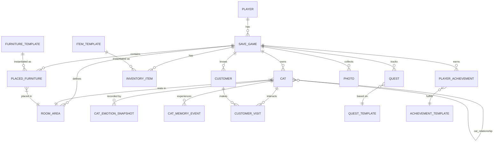
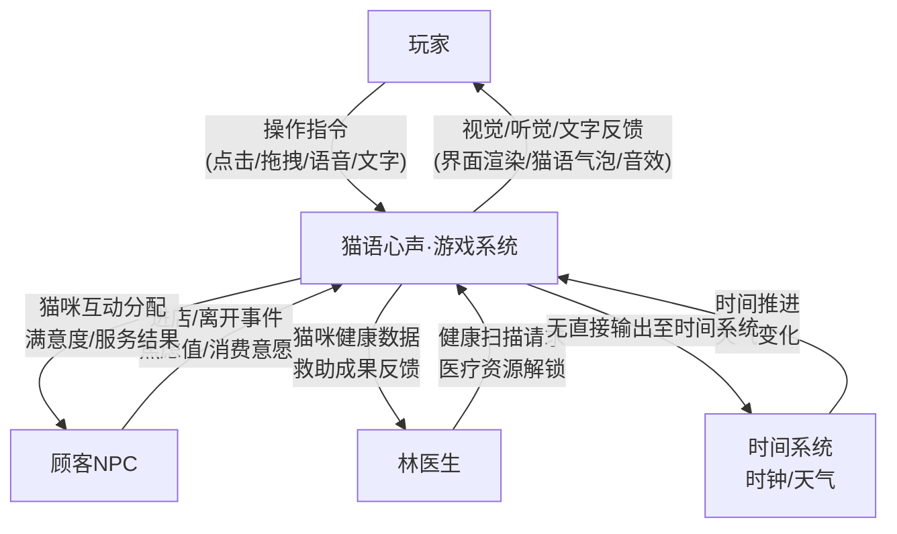
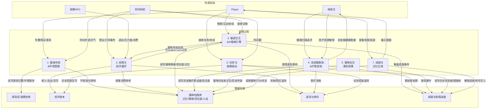
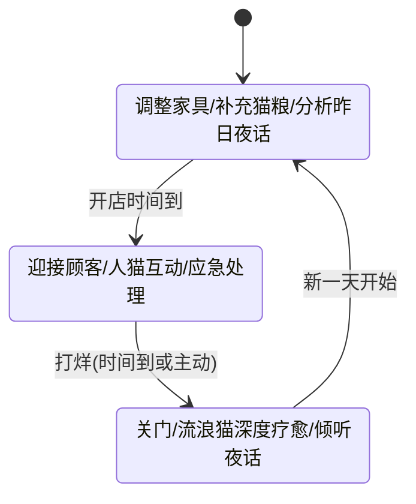
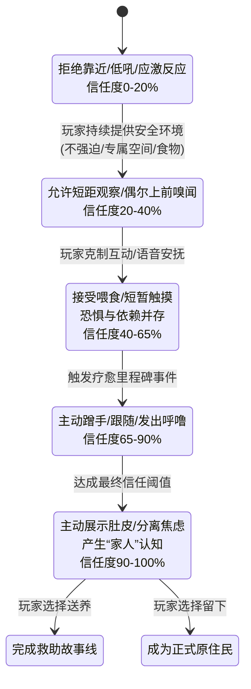
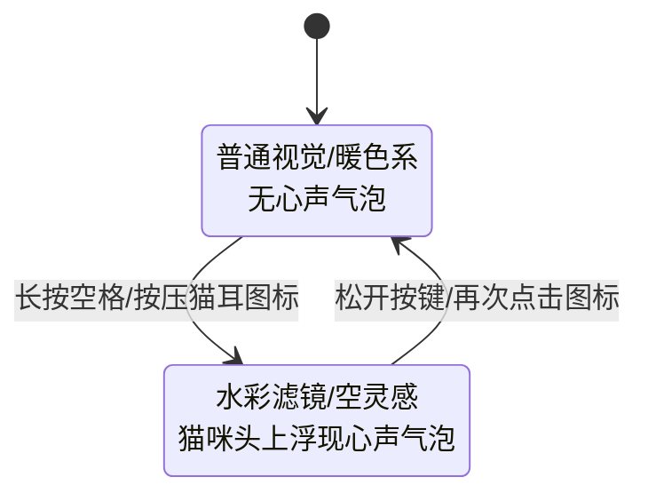
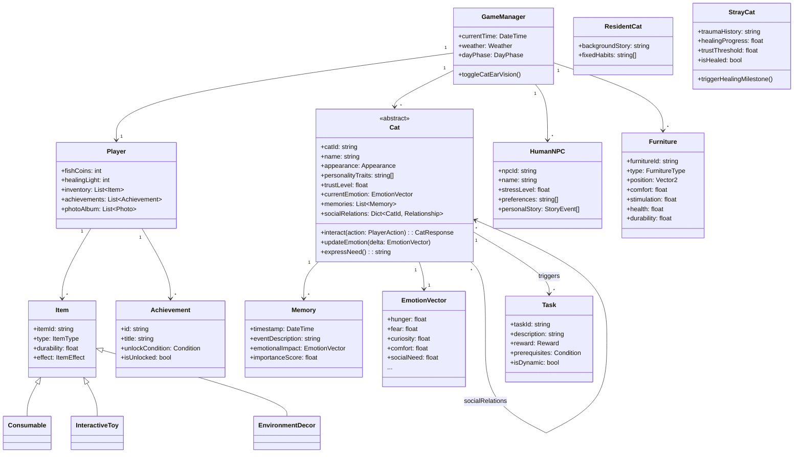
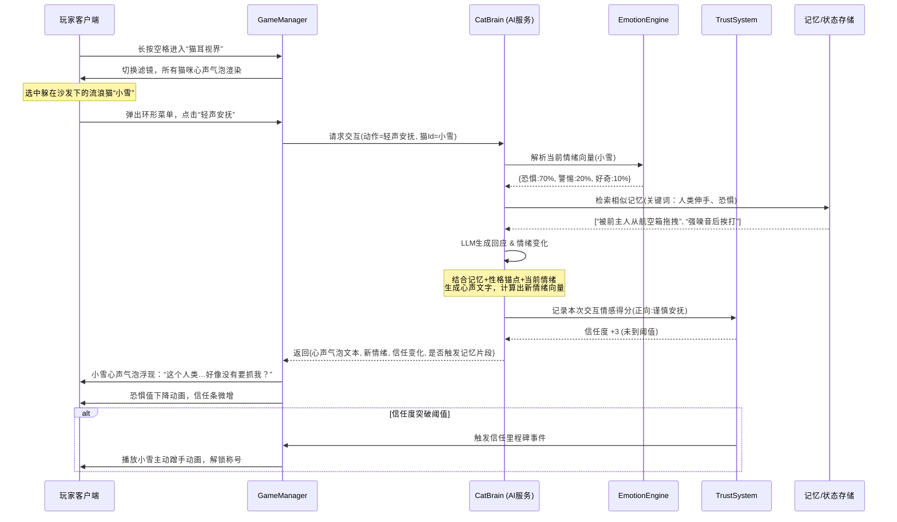
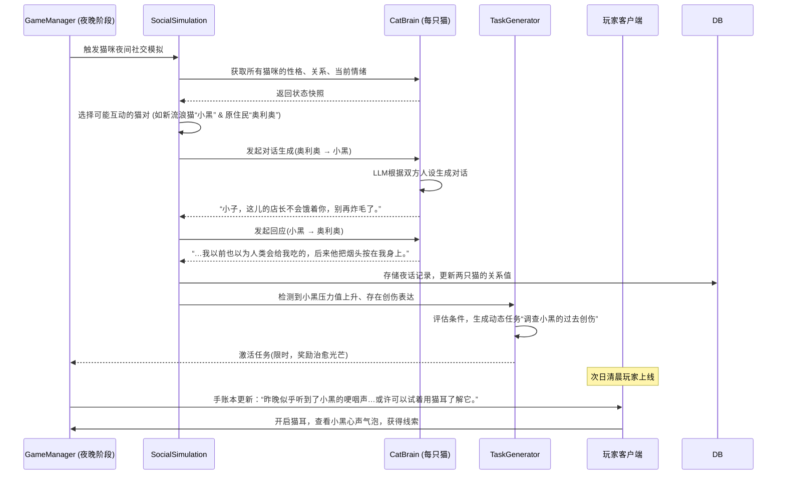
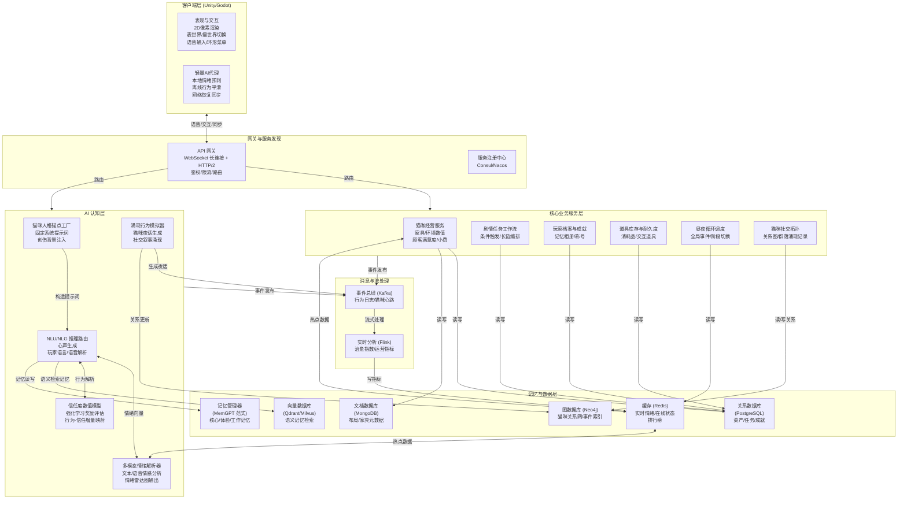

# 游戏概述

《猫语心声》是一款以AI智能驱动、主打治愈情感与长线双向羁绊的模拟经营游戏。玩家将意外获得听懂猫语的特殊能力，接手一间濒临倒闭的老旧街角猫咖，从零开启翻新经营、照料猫咪、救助流浪生命、打造专属温暖避风港的治愈旅程。

游戏以听懂猫语为核心设定，打破传统宠物经营游戏中工具化萌宠的固有模式。你将从3只性格、过往不同的原住民猫咪开启经营之路，全程能清晰听见每一只猫咪的内心独白，读懂它们藏在呼噜声与炸毛动作里的喜怒哀乐、隐秘诉求与不安过往。你可以凭借这份特殊能力，调整猫咖的空间布置、匹配到店顾客与猫咪的适配互动，在优先保障每一只猫咪幸福感的前提下，将这间落满灰尘的破落小店，一步步打造成人气与温度兼具的街角地标。

随着猫咖经营步入正轨，你将开启流浪猫救助的长线核心玩法。每一只待救助的流浪猫咪，都拥有专属的创伤经历、固定的性格锚点与完整的故事线，它们的信任从不是一次投喂就能获取的，需要你用持续的耐心与陪伴，读懂它们藏在猫语里的戒备与渴望，慢慢治愈过往的创伤，让这间猫咖成为更多流浪小生命的温暖归宿。

区别于传统经营游戏固定脚本的宠物行为，游戏中所有猫咪均由AI技术驱动，拥有终身留存的长期记忆、稳定统一的人设逻辑与自主涌现的互动行为。它们会记住你每一次的温柔陪伴、记得你许下的每一个小约定、记得你为它们抚平的每一次不安，会基于过往的经历与性格，主动向你发起互动、流露情绪、表达依赖。在长线的交互中，猫咪的核心人设稳定统一，不会出现行为割裂，让你和每一只独一无二的小生命，都能建立起双向奔赴的情感羁绊。

在这里，经营数值从来不是最终目标，赚得盆满钵满远不及让每一只猫咪都能安心蜷缩在阳光下打盹重要。你听懂的从来不止是猫语，更是每一个小生命，藏在心底对家、对爱、对安稳的渴望。

# ER图+数据字典（开发方面）

## 2.1 ER图



## 2.2 数据字典

### 2.2.1 玩家与存档

player

| 字段 | 类型 | 约束 | 描述 |
| --- | --- | --- | --- |
| player_id | INTEGER | PK | 玩家唯一标识 |
| nickname | TEXT | NOT NULL | 玩家昵称 |
| created_at | TEXT | NOT NULL | 账号创建时间 (ISO8601) |
| cloud_sync_token | TEXT |  | 云存档同步标记 |

save_game

| 字段 | 类型 | 约束 | 描述 |
| --- | --- | --- | --- |
| save_id | INTEGER | PK | 存档唯一标识 |
| player_id | INTEGER | FK -> player | 所属玩家 |
| save_name | TEXT | NOT NULL | 存档名（如“猫咖一号”） |
| fish_coin | INTEGER | NOT NULL DEFAULT 0 | 小鱼币数量 |
| heal_light | INTEGER | NOT NULL DEFAULT 0 | 治愈光芒数量 |
| game_time | TEXT | NOT NULL | 游戏内时间 (ISO格式，如"Thu 16:30") |
| day_cycle_phase | TEXT | CHECK(phase IN ('preparation','day','night')) | 当前昼夜阶段 |
| weather | TEXT |  | 天气（如“阵雨”） |
| cafe_name | TEXT |  | 猫咖自定义名称 |
| created_at | TEXT |  | 存档创建时间 |

### 2.2.2 核心：猫咪

cat

| 字段 | 类型 | 约束 | 描述 |
| --- | --- | --- | --- |
| cat_id | INTEGER | PK | 猫咪唯一ID |
| save_id | INTEGER | FK -> save_game, NOT NULL | 所属存档 |
| name | TEXT | NOT NULL | 猫咪名字 |
| breed | TEXT |  | 品种（奶牛猫/波斯猫/橘猫等） |
| appearance | TEXT |  | 外观特征（JSON描述） |
| personality_trait | TEXT |  | 性格锚点（傲娇/怯懦/乐天…） |
| backstory | TEXT |  | 背景故事文本 |
| cat_type | TEXT | CHECK( IN ('native','rescued')) | 原住 / 救助流浪 |
| trust_lv | INTEGER | NOT NULL DEFAULT 0 | 信任度 (0-100) |
| stress_lv | INTEGER | NOT NULL DEFAULT 50 | 压力值 (0-100) |
| hunger_lv | INTEGER | NOT NULL DEFAULT 50 | 饥饿值 (0-100) |
| energy_lv | INTEGER |  | 精力值 (0-100) |
| health_status | TEXT |  | 健康状态描述 |
| current_room_id | INTEGER | FK -> room_area | 当前所在房间区域 |
| is_isolated | INTEGER | DEFAULT 0 | 是否处于隔离状态（救助初期） |
| adoption_status | TEXT | CHECK(IN ('in_cafe','adopted','available')) | 领养状态 |

cat_emotion_snapshot

| 字段 | 类型 | 约束 | 描述 |
| --- | --- | --- | --- |
| snapshot_id | INTEGER | PK |  |
| cat_id | INTEGER | FK -> cat |  |
| recorded_time | TEXT |  | 游戏时间 |
| emotion_json | TEXT | NOT NULL | 复合情绪比例，如 {"hungry":0.3,"curious":0.5,"alert":0.2} |
| inner_monologue | TEXT |  | 心声气泡文本摘要（可用于UI） |

cat_memory_event

| 字段 | 类型 | 约束 | 描述 |
| --- | --- | --- | --- |
| memory_id | INTEGER | PK |  |
| cat_id | INTEGER | FK -> cat |  |
| event_type | TEXT |  | 事件类型（interaction, rescue, fight, comfort...） |
| description | TEXT | NOT NULL | 事件文字描述，供AI提示词使用 |
| emotion_impact_json | TEXT |  | 对情绪的影响值（如 {"trust": +5, "stress": -10}） |
| occured_at | TEXT |  | 游戏时间 |

### 2.2.3 猫咪之间的关系

cat_relationship

| 字段 | 类型 | 约束 | 描述 |
| --- | --- | --- | --- |
| cat_id_1 | INTEGER | FK -> cat |  |
| cat_id_2 | INTEGER | FK -> cat | 确保 cat_id_1 < cat_id_2 避免重复 |
| relationship_type | TEXT | CHECK(IN ('friendly','neutral','hostile')) | 关系类型 |
| affinity_value | INTEGER | DEFAULT 0 | 亲密度（-100~+100） |
| last_interaction_time | TEXT |  | 最近产生互动的时间 |

### 2.2.4 房间与环境

room_area

| 字段 | 类型 | 约束 | 描述 |
| --- | --- | --- | --- |
| room_id | INTEGER | PK |  |
| save_id | INTEGER | FK -> save_game |  |
| name | TEXT | NOT NULL | 区域名称（大厅、后院、静音隔间…） |
| is_unlocked | INTEGER | DEFAULT 0 | 是否已解锁 |
| comfort | REAL | DEFAULT 0 | 该区域总舒适度（由家具累加） |
| stimulation | REAL | DEFAULT 0 | 总刺激度 |
| hygiene | REAL | DEFAULT 0 | 卫生健康度 |

furniture_template

| 字段 | 类型 | 约束 | 描述 |
| --- | --- | --- | --- |
| furniture_tpl_id | INTEGER | PK |  |
| name | TEXT | NOT NULL | 家具名 |
| category | TEXT |  | 爬架/窝垫/玩具/其他 |
| base_comfort | REAL |  | 基础舒适值 |
| base_stimulation | REAL |  | 基础刺激值 |
| base_hygiene | REAL |  | 卫生影响值 |
| price_fish | INTEGER |  | 小鱼币价格 |
| material | TEXT |  | 材质（剑麻、纯棉…） |
| description | TEXT |  |  |

placed_furniture （家具实例）

| 字段 | 类型 | 约束 | 描述 |
| --- | --- | --- | --- |
| placed_id | INTEGER | PK |  |
| save_id | INTEGER | FK -> save_game |  |
| furniture_tpl_id | INTEGER | FK -> furniture_template |  |
| room_id | INTEGER | FK -> room_area |  |
| pos_x | REAL |  | 位置坐标x |
| pos_y | REAL |  | 坐标y |
| durability | REAL |  | 当前耐久度（如玩具） |
| state | TEXT |  | 状态信息（如“破损需维修”） |

### 2.2.5 道具与经济

item_template （道具/物品模板）

| 字段 | 类型 | 约束 | 描述 |
| --- | --- | --- | --- |
| item_tpl_id | INTEGER | PK |  |
| name | TEXT | NOT NULL | 猫条/逗猫棒/基础猫粮… |
| category | TEXT | CHECK(IN ('consumable','interactive','environment')) | 消耗/交互/环境 |
| effect_json | TEXT |  | 使用效果（如降低饥饿、增加信任条件） |
| max_durability | INTEGER |  | 交互类最大耐久 |
| price_fish | INTEGER |  | 小鱼币价格 |
| description | TEXT |  |  |

inventory_item （库存）

| 字段 | 类型 | 约束 | 描述 |
| --- | --- | --- | --- |
| inventory_id | INTEGER | PK |  |
| save_id | INTEGER | FK -> save_game |  |
| item_tpl_id | INTEGER | FK -> item_template |  |
| quantity | INTEGER | NOT NULL DEFAULT 1 | 数量（消耗品） |
| durability | INTEGER |  | 当前耐久（交互类单例时使用） |

### 2.2.6 顾客与访问

customer

| 字段 | 类型 | 约束 | 描述 |
| --- | --- | --- | --- |
| customer_id | INTEGER | PK |  |
| save_id | INTEGER | FK -> save_game |  |
| name | TEXT | NOT NULL | 林医生/打工人小陈… |
| npc_type | TEXT |  | 兽医/常客/随机顾客 |
| pressure_lv | INTEGER | DEFAULT 50 | 焦虑/压力值 |
| affection | INTEGER | DEFAULT 0 | 对猫咖好感度 |
| personal_story_progress | TEXT |  | 个人故事进度标记 |
| description | TEXT |  |  |

customer_visit

| 字段 | 类型 | 约束 | 描述 |
| --- | --- | --- | --- |
| visit_id | INTEGER | PK |  |
| customer_id | INTEGER | FK -> customer |  |
| cat_id | INTEGER | FK -> cat (可为空) | 主要互动的猫咪 |
| visit_time | TEXT |  | 进店时间 |
| satisfaction | INTEGER |  | 本次满意度 |
| notes | TEXT |  | 重要事件记录（如建立了情感联系） |

### 2.2.7 任务、成就与相册

quest_template （任务模板，策划配置）

| 字段 | 类型 | 约束 | 描述 |
| --- | --- | --- | --- |
| quest_tpl_id | INTEGER | PK |  |
| name | TEXT |  |  |
| description | TEXT |  |  |
| type | TEXT | CHECK(IN ('daily','dynamic','milestone')) | 常规/动态/里程碑 |
| goal_json | TEXT |  | 目标条件（如信任度>=80） |
| reward_fish | INTEGER |  | 小鱼币奖励 |
| reward_light | INTEGER |  | 治愈光芒奖励 |

quest （玩家当前任务）

| 字段 | 类型 | 约束 | 描述 |
| --- | --- | --- | --- |
| quest_id | INTEGER | PK |  |
| save_id | INTEGER | FK -> save_game |  |
| quest_tpl_id | INTEGER | FK -> quest_template |  |
| status | TEXT | CHECK(IN ('active','completed','failed')) |  |
| progress_json | TEXT |  | 当前进度 |

achievement_template

| 字段 | 类型 | 约束 | 描述 |
| --- | --- | --- | --- |
| achieve_tpl_id | INTEGER | PK |  |
| name | TEXT |  |  |
| description | TEXT |  |  |
| category | TEXT |  | 记忆相册/信任里程碑/经营 |
| unlock_condition_json | TEXT |  |  |

player_achievement

| 字段 | 类型 | 约束 | 描述 |
| --- | --- | --- | --- |
| achieve_id | INTEGER | PK |  |
| save_id | INTEGER | FK -> save_game |  |
| achieve_tpl_id | INTEGER | FK -> achievement_template |  |
| progress | REAL |  | 进度 0~1 |
| unlocked | INTEGER | DEFAULT 0 | 是否已解锁 |
| title_reward | TEXT |  | 授予的称号 |
| unlocked_at | TEXT |  | 解锁时间 |

photo （记忆相册）

| 字段 | 类型 | 约束 | 描述 |
| --- | --- | --- | --- |
| photo_id | INTEGER | PK |  |
| save_id | INTEGER | FK -> save_game |  |
| cat_id | INTEGER | FK -> cat (可多只，但简化) | 主要猫咪 |
| image_path | TEXT | NOT NULL | 截图本地路径 |
| caption | TEXT |  | 玩家或系统注释 |
| event_type | TEXT |  | 触发行为（“首次依偎入睡”等） |
| taken_at | TEXT |  | 游戏时间 |

# 数据流图(DFD)+状态图（业务方面）

DFD 的核心是数据如何在系统里流转，而不关注实现细节。我采用了经典的Yourdon/DeMarco风格，从顶层到底层逐级展开。

## 3.1 数据流图(DFD)

### 3.1.1 顶层图（上下文图）



### 3.1.2 第0层 DFD（系统主要处理模块）

这一层把“猫语心声·游戏系统”拆成7个核心处理过程和5大数据存储。箭头上标注的是数据流名称，方向就是数据流动的方向。



### 3.1.3 第1层 DFD —— 以“猫语交互&AI情绪引擎”为例展开

这是最能体现游戏差异化的子过程。我把它细化为更小的功能单元，让你们看清数据如何从玩家操作最终变成猫咪的心声气泡。

```mermaid
graph TD
    subgraph 玩家交互层
        Op_Click[点击/长按操作]
        Op_Speech[语音/文字输入]
    end

    subgraph 猫语交互核心
        P3_1[3.1 输入解析<br/>与意图识别]
        P3_2[3.2 猫咪AI<br/>情绪推理引擎]
        P3_3[3.3 心声文本<br/>与语音生成]
        P3_4[3.4 反馈<br/>与情绪状态更新]
    end

    DS_Cat[猫咪档案库]

    Op_Click -->|选择猫咪/动作指令| P3_1
    Op_Speech -->|安抚语音/文字| P3_1

    P3_1 -->|结构化交互请求<br/>(猫咪ID,动作类型,上下文)| P3_2
    P3_2 -- 读取历史记忆/当前情绪/性格锚点 --> DS_Cat
    P3_2 -->|复合情绪变化量<br/>(Δ信任度, Δ压力, Δ好奇...)| P3_4
    P3_2 -->|当前心理状态摘要| P3_3

    P3_3 -- 读取性格/过往记忆/当前情景 --> DS_Cat
    P3_3 -->|生成心声文本/语音| P3_4

    P3_4 -->|更新情绪值/信任度/记忆日志| DS_Cat
    P3_4 -->|猫语气泡/动画反馈| 界面渲染
```

## 3.2 业务状态图（Statechart Diagram）

DFD 展示的是数据流，状态图则刻画核心业务对象在时间轴上的生命周期。这里我提取了三个最重要的状态机。

### 3.2.1 游戏主循环：昼夜经营周期



### 3.2.3 猫咪信任度与疗愈进程（单只猫咪角度）



### 3.2.3 猫语系统本身的状态：表世界与里世界切换



# 类图+序列图（技术评审方面）

## 4.1 核心领域类图



## 4.2 关键交互序列图



## 4.3 猫咪社交夜话与动态任务涌现



# 架构拓扑图（架构设计方面）


