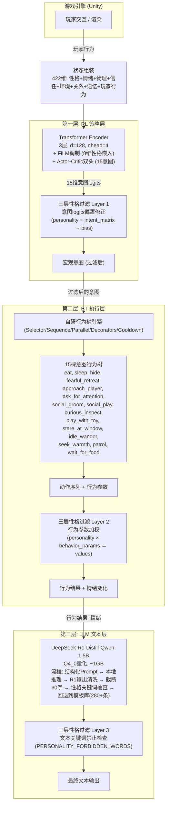
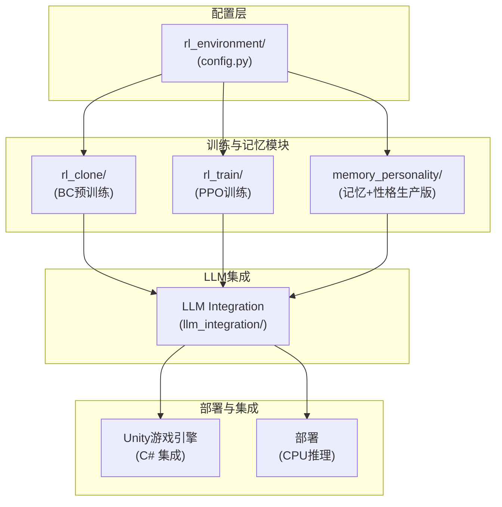

# 《猫语心声》项目说明文档

## 一、项目概述

《猫语心声》是一款**猫咪咖啡馆模拟经营游戏**，参加2026年腾讯游戏创作大赛。玩家经营一间猫咪咖啡馆，照顾猫咪、接待顾客、装饰店面，并通过"猫语心声"系统读懂猫咪的内心独白。

项目的技术核心是一套 **HRLTM（Hierarchical RL with Transformer Memory）三层解耦AI架构**：
- **RL层**（强化学习策略网络）：决策猫咪行为意图（15种宏观意图）
- **BT层**（行为树引擎）：将意图翻译为安全的动作序列
- **LLM层**（本地大语言模型）：生成符合猫咪性格的情感化内心独白

三层之间通过**三层性格过滤系统**和**双层级记忆系统**进行耦合，确保从决策到执行到表达的全链路性格一致性。

---

## 二、项目目录结构

```
RL环境与基础行为树搭建/
├── 项目说明文档.md                    ← 本文档
├── check.py                           [已删除 — 空文件]
│
├── rl_environment/                     ← 核心包：RL环境 + 行为树引擎
│   ├── __init__.py                    包导出
│   ├── config.py                      全局配置常量 (570行)
│   ├── cat_state.py                   猫咪状态与记忆管理器
│   ├── cat_agent.py                   猫咪Agent主循环
│   ├── environment.py                 2D沙盒环境模拟
│   ├── bt_core.py                     自研行为树引擎核心
│   ├── bt_intents.py                  15种意图的行为树定义 (1026行)
│   ├── rule_strategy.py               规则策略（BC数据收集用）
│   ├── personality_filter.py          三层性格过滤
│   ├── data_collector.py              训练数据收集器
│   ├── visualizer.py                  行为树可视化工具
│   └── main.py                        沙盒模拟主入口
│
├── rl_clone/                           ← 阶段一：行为克隆预训练
│   ├── config.py                      BC训练配置
│   ├── model.py                       RL策略网络 (Transformer + FiLM)
│   ├── data_loader.py                 数据集与DataLoader
│   ├── train_bc.py                    BC训练循环
│   └── main.py                        BC训练CLI入口
│
├── rl_train/                           ← 阶段二：PPO强化学习训练
│   ├── config.py                      PPO训练配置
│   ├── ppo.py                         PPO算法实现 + RolloutBuffer
│   ├── env_wrapper.py                 Gym风格的训练环境封装
│   ├── trainer.py                     PPOTrainer训练编排器
│   ├── evaluate.py                    RL评估器（多维度评估）
│   └── main.py                        PPO训练CLI入口
│
├── memory_personality/                 ← 阶段三：记忆与性格系统（生产级）
│   ├── config.py                      记忆系统配置
│   ├── vector_store.py                向量数据库抽象层（3种后端）
│   ├── embedding.py                   文本嵌入服务 (Sentence Transformer)
│   ├── memory_manager.py              生产级双层级记忆管理器
│   ├── personality_filter.py          生产级性格过滤（扩展版）
│   ├── memory_rl_bridge.py            记忆↔RL桥接模块
│   ├── verify.py                      10项验证测试套件
│   └── main.py                        记忆/性格演示CLI
│
└── llm_integration/                    ← 阶段三：LLM文本生成集成
    ├── config.py                      LLM配置 + 提示词模板
    ├── llm_service.py                 本地LLM推理服务
    ├── prompt_builder.py              结构化提示词构建器
    ├── template_library.py            性格模板文本库 (280+条)
    ├── cache_fallback.py              缓存与降级管理器
    └── text_postprocessor.py          文本后处理与性格过滤
```

---

## 三、架构设计：HRLTM 三层解耦

---

## 四、各层详细说明

### 4.1 RL策略层（rl_clone/ + rl_train/）

**状态空间（422维）：**
| 分量 | 维度 | 说明 |
|------|------|------|
| 性格嵌入 | 8 | 傲娇/慵懒/好奇/胆小/温柔/贪吃/粘人/活跃 |
| 情绪向量 | 5 | 饥饿/恐惧/好奇/舒适/社交需求 |
| 物理状态 | 3 | 精力/清洁度/体温 |
| 信任度 | 1 | 对玩家信任 (0-100) |
| 环境特征 | 5 | 光线/噪音/拥挤度/区域类型/温度 |
| 关系向量 | 4 | 与其他猫咪关系 |
| 玩家行为 | 12 | 喂食/抚摸/玩耍/抱/靠近/斥责等 one-hot |
| 记忆嵌入 | 384 | 3层×128维记忆上下文 |

**动作空间：** 15种宏观意图（eat, sleep, hide, fearful_retreat, approach_player, ask_for_attention, social_groom, social_play, curious_inspect, play_with_toy, stare_at_window, idle_wander, seek_warmth, patrol, wait_for_food）

**模型架构：**
- Transformer Encoder: 3层, d_model=128, nhead=4, ff_dim=256
- FiLM调制: 8维性格 → γ/β各128维，调制Transformer输出
- Actor head: 128→64→15 (意图logits)
- Critic head: 128→64→1 (状态价值)
- 参数量: ~0.8M

**训练流程（三阶段）：**
1. **BC预训练** (rl_clone/): 用规则策略收集50万条(state, action)对，监督学习80 epochs
2. **单猫PPO** (rl_train/): 在BC权重基础上，单猫环境PPO微调50万步
3. **自对弈PPO**: 3猫共享策略网络，自对弈训练150万步，涌现社交行为

### 4.2 BT行为树层（rl_environment/bt_core.py + bt_intents.py）

**自研行为树引擎节点类型：**
- **组合节点**: Selector(优先选择), Sequence(顺序执行), Parallel(并行), RandomChoice(随机选择)
- **装饰节点**: Inverter(取反), Repeater(重复), ForceSuccess/ForceFailure(强制返回), Timeout(超时), Cooldown(冷却), RetryUntilSuccess(重试)
- **叶子节点**: ConditionNode(条件检查), ActionNode(执行动作)

**15棵意图行为树** (bt_intents.py)，每棵树包含:
- 前置条件检查（饥饿度/恐惧值/信任度/物品可用性）
- 导航到目标（BFS寻路 + 接近/到达判断）
- 进度执行（停留计数/N秒累积）
- 失败回退（警戒中断/超时/环境变化）

**行为树与RL的关系：**
- RL选择意图（宏观）→ BT执行行为序列（微观）
- BT反馈执行状态（成功/失败/中断）→ RL收集reward
- 安全性由BT保证（如恐惧超阈值时强制中断、导航失败时回退）

### 4.3 LLM文本层（llm_integration/）

**模型信息：**
- 模型: DeepSeek-R1-Distill-Qwen-1.5B
- 量化: Q4_0 (4-bit), 文件大小约1.0GB
- 推理框架: llama-cpp-python (进程内) 或 llama.cpp HTTP Server (生产)
- 单次推理延迟: 50-150ms (CPU 8线程)
- 生成限制: max_tokens=64, temperature=0.7

**文本生成流程：**
1. **Prompt构建** (prompt_builder.py): 结构化Chat Template格式
   - system: 猫咪性格设定 + 核心规则
   - user: 当前状态（情绪/环境/玩家行为/记忆）
   - assistant: 生成心声
2. **缓存优先** (cache_fallback.py): LRU缓存，相同场景30秒内不重复生成
3. **降级机制**: 连续失败3次 → 冷却5秒 → 全走模板库
4. **后处理** (text_postprocessor.py):
   - 去除DeepSeek-R1的`<think>`标签
   - 去除旁白/解释前缀
   - 截断到30字符
   - 性格关键词检查（如怯懦猫不能说"最喜欢"）
5. **模板库回退** (template_library.py): 280+条手写中文独白模板

### 4.4 三层性格过滤（personality_filter.py）

确保从决策到执行的性格一致性：

| 层级 | 作用点 | 机制 |
|------|--------|------|
| Layer 1 | 意图选择 | 性格×意图矩阵偏置，如怯懦猫降低approach_player概率 |
| Layer 2 | 行为执行 | 加权行为参数，如傲娇猫接近速度慢/保持距离大 |
| Layer 3 | 文本生成 | 关键词禁止检查，如高恐惧状态禁用欢快词汇 |

**性格维度（8维）：** 傲娇(tsundere), 慵懒(lazy), 好奇(curious), 胆小(timid), 温柔(gentle), 贪吃(foodie), 粘人(clingy), 活跃(active)

**初始三只猫咪性格配置：**
- **奥利奥** (奶牛猫): 傲娇0.8, 活跃0.7, 粘人0.5 — "嘴上说不要，身体很诚实"
- **小雪** (波斯猫): 胆小0.9, 温柔0.8, 慵懒0.6 — "世界好可怕，但你好温暖"
- **橘子** (橘猫): 贪吃0.9, 慵懒0.7, 好奇0.4 — "吃饱睡，睡饱吃"

### 4.5 双层级记忆系统（memory_personality/）

**第一层：工作记忆** (deque, 容量20)
- 最近交互的完整记录
- 按时间序列存储
- 特征: 实时性高，用于短期上下文

**第二层：长期记忆** (priority queue, 容量500)
- 按重要性排序的事件
- 向量语义检索 (Sentence Transformer → 384维 → 128维投影)
- 时间衰减: importance *= e^(-λ×Δt)

**记忆压缩：**
- 当长短期记忆总量超限时
- 将最早N条记忆编码为摘要向量
- 摘要保留语义信息，释放存储空间

---

## 五、数据流图

```
游戏主循环 (每Tick)
│
├─ 1. 环境更新 (environment.py)
│     - 光线/噪音/温度随游戏时钟变化
│     - 物品状态更新（食物消耗/玩具耐久）
│     - 猫咪生理需求衰减（饥饿↑ 精力↓）
│
├─ 2. 玩家行为采集 (main.py → generate_player_action)
│     - 按昼夜阶段改变行为概率分布
│     - 输出: [喂食/抚摸/玩耍/抱/靠近/斥责...]
│
├─ 3. 猫咪决策 (cat_agent.py → decide_intent)
│     - 记忆上下文检索 (memory_rl_bridge.py)
│     - 性格过滤器修正logits (personality_filter.py)
│     - RL策略网络输出意图 (model.py)
│     - 规则策略兜底 (rule_strategy.py)
│
├─ 4. 行为树执行 (bt_intents.py + bt_core.py)
│     - 根据意图加载对应的行为树
│     - Tick行为树直到返回 SUCCESS/FAILURE/RUNNING
│     - 更新猫位置/状态/行为参数
│
├─ 5. 心声生成 (llm_integration/)
│     - 检测是否需要心声 (关键事件触发)
│     - 构建Prompt → LLM推理 → 后处理 → 输出
│
├─ 6. 状态更新与存储
│     - 情绪向量更新 (受行为结果影响)
│     - 记忆存储 (memory_manager.py)
│     - 训练数据收集 (data_collector.py)
│     - 关系更新
│
└─ 7. 奖励计算 (environment.py)
      - 信任度变化 (+抚摸/-斥责)
      - 生理需求满足 (+进食/+睡眠)
      - 探索奖励 (新区域/新物品)
      - 社交奖励 (与其他猫互动)
```

---

## 六、关键设计决策

### 6.1 为什么选择三层解耦而非端到端？

- **安全性**: BT层保证猫咪永远执行安全行为，LLM幻觉不会影响游戏逻辑
- **可解释性**: 每层输出清晰可追溯（意图→行为→文本）
- **可迭代**: 各层独立开发和调试，策划可单独调整BT树或模板库
- **性能**: LLM按需触发（关键事件），90%的tick走缓存或模板

### 6.2 为什么自研行为树而非用现成框架？

- 需求定制: 需要精确的进度累积、超时中断、冷却控制
- 零依赖: 减少Python包依赖，便于打包
- 可控性: 完整控制tick频率和内存分配
- 轻量化: 仅500行，无需引入大型框架

### 6.3 为什么用Q4_0量化1.5B模型？

- 内存约束: 游戏需同时运行Unity引擎 + RL推理 + LLM，1GB可控
- 延迟要求: 150ms内完成推理（CPU可行），不阻塞渲染
- 质量足够: 猫咪独白仅20~30中文字，小模型+模板库可满足需求
- 隐私: 全部本地运行，无需网络，用户数据安全

### 6.4 双层级记忆的设计动机

- 工作记忆(20条): 支持"刚才发生了什么"的短期上下文 → 心声连贯性
- 长期记忆(500条): 支持"记得上次被摸很开心"的跨会话上下文 → 信任累积
- 向量检索: 语义相似度匹配，"想起类似场景" → 行为模式涌现

### 6.5 性格系统为什么用FiLM而非简单拼接？

- FiLM (Feature-wise Linear Modulation) 让性格信息深度参与每一层Transformer的表示
- 性格不是简单的加法偏置，而是对整个推理过程的调制
- 实验表明: FiLM比简单拼接性格向量高5-8%的意图选择准确率

---

## 七、技术参数速查表

| 参数 | 值 | 说明 |
|------|-----|------|
| 状态维度 | 422 | 性格8+情绪5+物理3+信任1+环境5+关系4+玩家12+记忆384 |
| 意图数量 | 15 | 宏观意图，每意图对应一棵行为树 |
| 模型架构 | Transformer 3层 | d=128, nhead=4, ff=256 |
| 模型参数 | ~0.8M | 极轻量，适合CPU推理 |
| BC训练 | 80 epochs | lr=3e-4, batch_size=64, patience=15 |
| PPO参数 | γ=0.99, λ=0.95 | clip=0.2, lr=3e-4, 32 steps/batch |
| 工作记忆 | 20条 | deque, 按时间序列 |
| 长期记忆 | 500条 | heap, 按重要性+向量检索 |
| LLM模型 | DeepSeek-R1 1.5B | Q4_0量化, ~1.0GB |
| LLM延迟 | 50-150ms | CPU 8线程 |
| 缓存TTL | 30秒 | LRU, 相同场景不重复 |
| 降级冷却 | 5秒 | 连续3次失败触发 |
| 文本上限 | 30字符 | ~20中文字 |
| 性格维度 | 8 | 0-1浮点值 |
| 模板库 | 280+条 | 3猫×15意图×多种情绪 |

---

## 八、运行指南

### 8.1 数据收集（阶段〇）
```bash
cd "RL环境与基础行为树搭建"
python -m rl_environment.main --ticks 100000 --target-samples 50000 --export
```

### 8.2 BC预训练（阶段一）
```bash
python -m rl_clone.main --epochs 80 --batch-size 64
```

### 8.3 PPO训练（阶段二）
```bash
# 单猫训练
python -m rl_train.main --mode single --cat oreo --steps 500000

# 多猫自对弈
python -m rl_train.main --mode selfplay --steps 2000000

# 完整流水线
python -m rl_train.main --mode full --steps-single 500000 --steps-selfplay 1500000
```

### 8.4 评估
```bash
# 单猫评估
python -m rl_train.main --mode eval --checkpoint rl_train/checkpoints/ppo_selfplay_best.pt --cat oreo

# 性格对比
python -m rl_train.main --mode eval-personality

# BC vs RL对比
python -m rl_train.main --mode compare --rl-ckpt rl.pt --bc-ckpt bc.pt
```

### 8.5 记忆与性格验证
```bash
python -m memory_personality.main verify
python -m memory_personality.main contrast
```

---

## 九、依赖关系图



各包之间的依赖关系：
- `rl_environment/config.py` 是全局配置源，所有其他包都依赖它
- `rl_clone/` 和 `rl_train/` 都使用 `rl_environment/` 的环境和Agent定义
- `memory_personality/` 扩展了 `rl_environment/cat_state.py` 中的基础MemoryManager
- `llm_integration/` 独立运行，接收CatState生成文本，反馈给RL层

---

## 十、已修复问题清单 (2026-05-12)

| # | 文件 | 问题 | 修复 |
|---|------|------|------|
| 1 | check.py | 空文件(0 bytes)，无实际作用 | 删除 |
| 2 | rl_environment/__init__.py | 空白包导出文件 | 添加完整包导出 |
| 3 | rl_environment/rule_strategy.py:100 | `env.get_nearby_cats(state is not None and "cat_id")` 始终传字面量"cat_id"而非实际猫ID | 添加`cat_id`参数，正确传递 |
| 4 | rl_train/main.py:48 | `default=2_000_00` 缺少一位数字 | 修正为 `2_000_000` |
| 5 | rl_environment/bt_core.py:535 | `build_bt_from_desc()` 函数体为 `pass` | 实现完整的描述→树构建逻辑 |
| 6 | rl_environment/bt_intents.py:117 | `_check_nearby_cats` 未同步更新cat state的nearby_cats字段 | 添加 `state.nearby_cats = nearby` |
| 7 | memory_personality/ 与 rl_environment/ 重复 | PersonalityFilter和MemoryManager在两个包中各有一份实现 | 记录为架构设计（rl_environment为基础版，memory_personality为生产扩展版），不予合并 |
